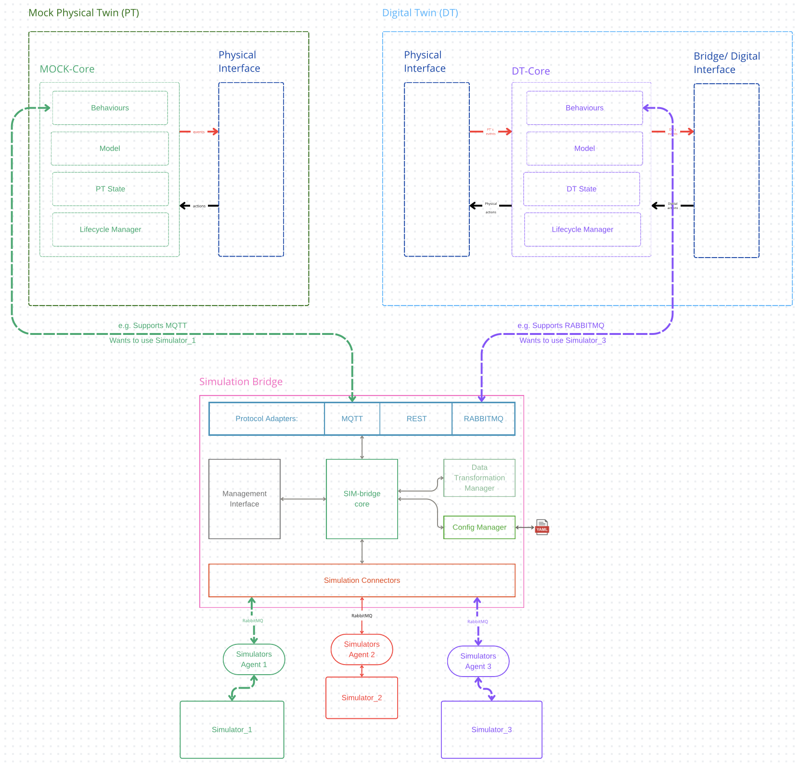

# Simulation Bridge

The **Simulation Bridge** is an open-source middleware solution designed to enable seamless and dynamic communication between **Digital Twins (DT)**, **Mock Physical Twins (MockPT)**, and their dedicated **Simulator** counterparts. It serves as a **modular, reusable, and bidirectional** bridge, supporting multiple protocols and interaction modes to ensure interoperability across diverse simulation environments. Built around the concept of simulation, the bridge facilitates control, monitoring, and data exchange among the involved entities, providing a universal middleware solution that enhances flexibility and integration within simulation-based systems.

## Key Features

### Protocol Flexibility

- Supports **RabbitMQ**, **MQTT**, **REST**, and custom protocols via a modular plugin architecture. By default, **RabbitMQ** is used for robust security and reliability, but the system allows for protocol customization based on specific needs.

### Simulation Control

- Manage simulations through standardized commands (e.g., **start**, **stop**, **status**) issued by the **Digital Twin (DT)** or **Mock Physical Twin (MockPT)**. The control logic is delegated to the connected entities, providing flexibility in simulation management.

### Interaction Modes

- **Final Result**: Executes simulations without real-time monitoring, focusing purely on the end result.
- **Interactive**: Allows for real-time monitoring and interaction during simulation execution.
- **Hybrid**: Combines batch execution with interactive control, enabling both automated and real-time adjustments.

### Discoverability

- Leverages a dynamic capability detection system through an **agent** mechanism. Agents report available simulator features (such as control options and accessible objects) to the bridge, facilitating plug-and-play integration with new simulators.

### Data Transformation

- Transforms data between various formats (e.g., **JSON**, **XML**, **CSV**) to ensure compatibility between systems and facilitate communication between diverse platforms.

## Out of Scope

- **Data Storage**: The bridge does not persist any data.
- **File Handling**: File-based communication is not supported.

## Architecture

The **Simulation Bridge** is built on a **modular, plugin-driven architecture**, designed to be highly extensible and adaptable to various simulation environments:

- **Protocol Plugins**: Handle communication via supported protocols (e.g., RabbitMQ, MQTT).
- **Agent System**: Dynamically discovers simulator capabilities and registers them with the bridge.
- **Data Transformers**: Ensure cross-system compatibility by translating data between different formats.
- **Command Dispatcher**: Routes simulation control commands and manages the interaction modes.

## License

This project is protected under the **INTO-CPS Association Public License (ICAPL) v1.0**. The license offers three alternatives for use and redistribution of the software:

1. **GPL v3**: The project can be used and redistributed under the terms of the GNU General Public License version 3.
2. **ICA-Internal-EPL**: Available to Silver Level members of the INTO-CPS Association for use and redistribution within their organization.
3. **ICA-External-EPL**: Available to Gold Level members of the INTO-CPS Association for use and redistribution, with additional conditions for distribution to external parties in binary/object code form.

This license ensures that the project is open-source, while also providing different redistribution options based on membership levels within the INTO-CPS Association.
