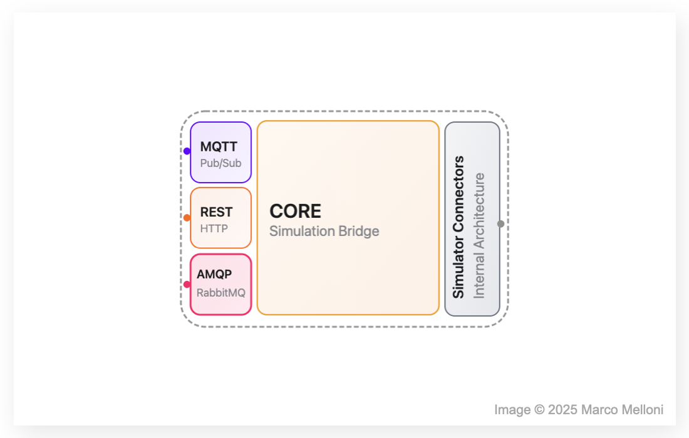

# Simulation Bridge

Simulation Bridge (_sim-bridge_) is a middleware solution designed to run distributed simulation systems of Digital Twins (DT), Mock Physical Twin (MockPT) and/or Physical Twin (PT).

It serves as a _modular_, _reusable_, and _bidirectional_ communication bridge, purpose-built to manage, control and monitor simulations over different simulators.

<p align="center">
  
  <br>
  <em>Figure 1: Simulation Bridge Architecture </em>
</p>

## Table of Contents

- [Simulation Bridge](#simulation-bridge)
  - [Table of Contents](#table-of-contents)
  - [Key Features](#key-features)
    - [Agents](#agents)
    - [Modes of Simulation](#modes-of-simulation)
    - [Plug-in Protocol Adapters](#plug-in-protocol-adapters)
  - [Requirements](#requirements)
    - [1. Clone the Repository and Navigate to the Working Directory](#1-clone-the-repository-and-navigate-to-the-working-directory)
    - [2. Install Poetry and Create Virtual Environment](#2-install-poetry-and-create-virtual-environment)
    - [3. Install Project Dependencies](#3-install-project-dependencies)
    - [4. Install RabbitMQ](#4-install-rabbitmq)
      - [Option 1: Install RabbitMQ Locally](#option-1-install-rabbitmq-locally)
      - [Option 2: Use a Remote RabbitMQ Server](#option-2-use-a-remote-rabbitmq-server)
    - [5. Generate HTTPS Certificate](#5-generate-https-certificate)
  - [Configuration](#configuration)
  - [Usage](#usage)
    - [Getting Started](#getting-started)
      - [Running with the Default Configuration](#running-with-the-default-configuration)
      - [Running with a Custom Configuration File](#running-with-a-custom-configuration-file)
  - [Documentation](#documentation)
    - [Simulation Bridge](#simulation-bridge-1)
    - [Matlab Agent](#matlab-agent)
  - [Package Development](#package-development)
  - [License](#license)
  - [Author](#author)

## Key Features

#### Agents

Agent is a software connector that acts as an interpreter between _sim-bridge_ and the specific simulator. Each simulator requires its own Agent, which must be designed to be reusable across diverse simulation scenarios for that simulator.

> Refer to the [Matlab Agent](agents/matlab/README.md) for an implementation example.

#### Modes of Simulation

_sim-bridge_ supports Batch and Streaming simulation modes, allowing for both discrete and real-time streaming simulation workflows:

| Mode      | Description                                                                                                                                     |
| --------- | ----------------------------------------------------------------------------------------------------------------------------------------------- |
| Batch     | Inputs are provided at the start, the simulation runs to completion without intermediate monitoring, and results are delivered only at the end. |
| Streaming | Enables real-time, step-by-step updates from the simulation during execution                                                                    |

#### Plug-in Protocol Adapters

The system follows a _plug-in-based protocol adapter architecture_, enabling seamless future integration of additional protocols.
It currently supports MQTT, RabbitMQ, and RESTful interfaces, allowing external clients to communicate with the _sim-bridge_ through these channels.

<p align="center">
  
  <br>
  <em>Figure 2: Plug-in Protocol Adapter Architecture </em>
</p>

## Requirements

#### 1. Clone the Repository and Navigate to the Working Directory

```bash
git clone https://github.com/INTO-CPS-Association/simulation-bridge.git
cd simulation-bridge
```

#### 2. Install Poetry and Create Virtual Environment

Ensure that Poetry is installed on your system. If it is not already installed, execute the following commands:

```bash
python3 -m pip install --user pipx
python3 -m pipx ensurepath
pipx install poetry
```

Verify the installation by checking the Poetry version:

```bash
poetry --version
```

Activate the virtual environment:

```bash
poetry env activate
```

> **Important:**  
> The command `poetry env activate` does not automatically activate the virtual environment; instead, it prints the command you need to run to activate it.  
> You must copy and paste the displayed command, for example:

```bash
source /path/to/virtualenv/bin/activate
```

Verify that the environment is active by checking the Python path:

```bash
which python
```

#### 3. Install Project Dependencies

Run the following command to install all dependencies defined in `pyproject.toml`:

```bash
poetry install
```

#### 4. Install RabbitMQ

The _sim-bridge_ requires an active RabbitMQ server. You can choose one of the following options:

##### Option 1: Install RabbitMQ Locally

If you do not have access to an external RabbitMQ server, you can install one locally. On macOS, use Homebrew:

```bash
brew update
brew install rabbitmq
brew services start rabbitmq
```

Verify that RabbitMQ is running:

```bash
brew services list
rabbitmqctl status
lsof -i :5672
```

##### Option 2: Use a Remote RabbitMQ Server

Alternatively, connect to an existing RabbitMQ instance hosted on a remote server (on-premise or cloud).

#### 5. Generate HTTPS Certificate

To enable the REST Protocol Adapter and support HTTP/2.0, it is necessary to generate an HTTPS Certificate.

## Configuration

```yaml
# Unique identifier for this simulation bridge instance
simulation_bridge:
  bridge_id: simulation_bridge # Must be unique if running multiple bridges

# Configuration for RabbitMQ protocol adapter
rabbitmq:
  host: localhost # RabbitMQ server hostname or IP
  port: 5672 # RabbitMQ port (default is 5672)
  virtual_host: / # RabbitMQ virtual host to use

  infrastructure:
    exchanges:
      # Define all the exchanges used by the bridge
      - name: ex.input.bridge # Incoming messages from clients
        type: topic # Exchange type (topic allows routing via routing keys)
        durable: true # Should survive RabbitMQ restarts
        auto_delete: false # Should not be deleted when unused
        internal: false # Accessible to clients

      - name: ex.bridge.output # Messages forwarded to simulator
        type: topic
        durable: true
        auto_delete: false
        internal: false

      - name: ex.sim.result # Results from simulator
        type: topic
        durable: true
        auto_delete: false
        internal: false

      - name: ex.bridge.result # Final result for clients
        type: topic
        durable: true
        auto_delete: false
        internal: false

    queues:
      # Queues for consuming messages
      - name: Q.bridge.input # Bridge input queue
        durable: true # Should survive server restarts
        exclusive: false # Can be shared by multiple consumers
        auto_delete: false # Should not be deleted automatically

      - name: Q.bridge.result # Queue for receiving simulation results
        durable: true
        exclusive: false
        auto_delete: false

    bindings:
      # Bind queues to exchanges using routing keys
      - queue: Q.bridge.input
        exchange: ex.input.bridge
        routing_key: "#" # Receive all messages (wildcard)

      - queue: Q.bridge.result
        exchange: ex.sim.result
        routing_key: "#" # Receive all messages (wildcard)

# Configuration for MQTT protocol adapter
mqtt:
  host: localhost # MQTT broker host
  port: 1883 # MQTT port (default is 1883)
  keepalive: 60 # Keepalive interval in seconds
  input_topic: bridge/input # Topic to subscribe to for input
  output_topic: bridge/output # Topic to publish results
  qos: 0 # Quality of Service level (0: at most once)

# Configuration for REST protocol adapter
rest:
  host: 0.0.0.0 # Host IP to bind the REST server (0.0.0.0 = all interfaces)
  port: 5000 # Port to run the REST server
  input_endpoint: /message # Endpoint for receiving messages
  debug: false # Enable/disable Flask debug mode

  client:
    host: localhost # REST client target host
    port: 5001 # Port of the external REST receiver
    base_url: http://localhost:5001 # Base URL for outgoing REST requests
    output_endpoint: /result # Path for sending result messages

# Logging configuration
logging:
  level: INFO # Logging level (DEBUG, INFO, WARNING, ERROR, CRITICAL)
  format: "%(asctime)s - %(name)s - %(levelname)s - %(message)s" # Log format
  file: logs/sim_bridge.log # File path to store logs
```

## Usage

The _sim-bridge_ requires a configuration file to run.

### Getting Started

**Generate a configuration file template:**

```bash
poetry run simulation-bridge --generate-config
```

This command creates a `config.yaml` file in your current directory. If the file already exists, it will not be overwritten. It will create a copy of `simulation_bridge/config/config.yaml.template`, which you can modify according to your environment.

#### Running with the Default Configuration

Once the configuration file is in place, start the _sim-bridge_ with:

```bash
poetry run simulation-bridge
```

By default, the application looks for the configuration file at `simulation_bridge/config/config.yaml.template`.

#### Running with a Custom Configuration File

If you want to use a custom `config.yaml` file, run the `simulation-bridge` command with the `--config-file` or `-c` option followed by the path to your configuration file:

```bash
poetry run simulation-bridge --config-file <path_to_config.yaml>
```

Alternatively, you can use the shorthand `-c` option:

```bash
poetry run simulation-bridge -c <path_to_config.yaml>
```

## Documentation

### Simulation Bridge

- [🏗️ **Internal Architecture** ↗](simulation_bridge/docs/internal_architecture.md): Overview of the system's architecture, key modules, and their interactions.

### Matlab Agent

- [🔗 **Matlab Agent** ↗](agents/matlab/README.md): Explanation of the MATLAB agent functionality and configuration.
- [⚙️ **Matlab Simulation Constraints** ↗](agents/matlab/matlab_agent/docs/README.md): A breakdown of the constraints and requirements for MATLAB-driven simulations.

## Package Development

The developer-specific commands are

```bash
pylint simulation_bridge
autopep8 --in-place --aggressive --recursive 'simulation_bridge'
```

## License

This project is licensed under the **INTO-CPS Association Public License v1.0**.  
See the [LICENSE](./LICENSE) file for full license text.

## Author

<div style="display: flex; flex-direction: column; gap: 25px;"> <!-- Marco Melloni --> <div style="display: flex; align-items: center; gap: 15px;">  <div> <h3 style="margin: 0;">Marco Melloni</h3> <p style="margin: 4px 0;">Digital Automation Engineering Student<br> University of Modena and Reggio Emilia, Department of Sciences and Methods for Engineering (DISMI)</p> <div> <a href="https://www.linkedin.com/in/marco-melloni/">  </a> <a href="https://github.com/marcomelloni" style="margin-left: 8px;">  </a> </div> </div> </div> <!-- Marco Picone --> <div style="display: flex; align-items: center; gap: 15px;">  <div> <h3 style="margin: 0;">Prof. Marco Picone</h3> <p style="margin: 4px 0;">Associate Professor<br> University of Modena and Reggio Emilia, Department of Sciences and Methods for Engineering (DISMI)</p> <div> <a href="https://www.linkedin.com/in/marco-picone-8a6a4612/">  </a> <a href="https://github.com/piconem" style="margin-left: 8px;">  </a> </div> </div> </div> <!-- Prasad Talasila --> <div style="display: flex; align-items: center; gap: 15px;"> <!-- Placeholder image -->  <div> <h3 style="margin: 0;">Dr. Prasad Talasila</h3> <p style="margin: 4px 0;">Postdoctoral Researcher<br> Aarhus University</p> <div> <a href="https://www.linkedin.com/in/prasad-talasila/">  </a> <a href="https://github.com/prasadtalasila" style="margin-left: 8px;">  </a> </div> </div> </div> </div>
