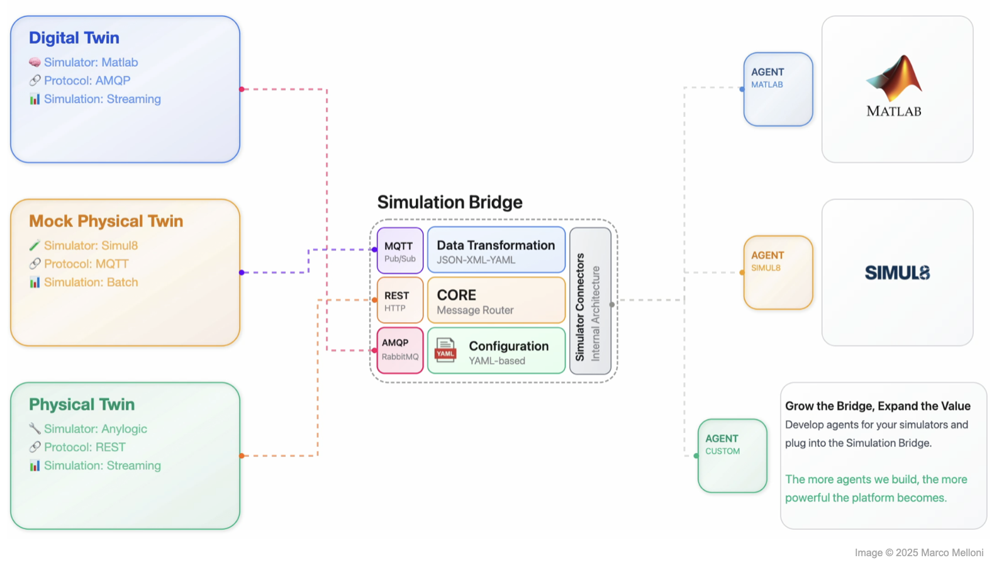

# Simulation Bridge

The **Simulation Bridge** is an open-source middleware solution designed to enable seamless and dynamic communication between Digital Twins (DT), Mock Physical Twins (MockPT), and their dedicated Simulator counterparts. It serves as a **modular**, **reusable**, and **bidirectional** bridge, supporting multiple protocols and interaction modes to ensure interoperability across diverse simulation environments.

Built around the concept of simulation, the bridge facilitates control, monitoring, and data exchange among the involved entities, providing a universal middleware solution that enhances flexibility and integration within simulation-based systems.

## Overview

---

## Key Features

### Protocol Support

- RabbitMQ (default)
- MQTT
- REST API
- Custom protocol plugins

### Interaction Modes

| Mode            | Description                                          |
| --------------- | ---------------------------------------------------- |
| **Batch**       | Execute simulations without real-time monitoring     |
| **Interactive** | Real-time monitoring and control                     |
| **Hybrid**      | Combine batch execution with interactive adjustments |

### Discoverability

- Dynamic capability detection via agent system
- Automatic registration of simulator features

### Data Transformation

- JSON ↔ XML ↔ CSV conversion
- Protocol-agnostic data formatting

---

## Documentation

- [**MATLAB Agent** ↗](agents/matlab_agent/README.md)

---

## License

This project is licensed under the **INTO-CPS Association Public License v1.0**.  
See the [LICENSE](./LICENSE) file for full license text.

---

## Author

  
  

    <h3 style="margin: 0;">Marco Melloni</h3>
    

      
      
    

  

