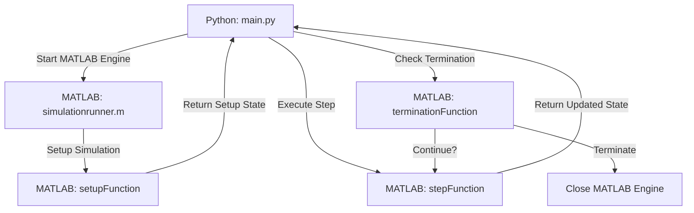

# MATLABagent alternatives for streaming simulations via Matlab API ENGINE

The `main.py` (Python) and `simulationrunner.m` (MATLAB) files collaborate to manage modular simulations in MATLAB, orchestrated by Python. This setup allows for defining and executing complex MATLAB simulations while leveraging Python's scripting and automation capabilities.

Communication between Python and MATLAB is facilitated by the MATLAB Engine API for Python. This synchronous communication ensures that each MATLAB command executed from Python completes before Python proceeds. Data is exchanged between the two environments using internal APIs, avoiding the need for file or network-based transfers.

---

### General Workflow Overview

#### `simulationrunner.m`: MATLAB Simulation Framework

The `SimulationRunner` MATLAB class provides a reusable framework for iterative simulations. By customizing the `setup`, `step`, and `termination` functions, it can adapt to various simulation scenarios.

**Core Features:**

- **Setup:** Initializes the simulation using a user-defined `setupFunction`.
- **Step Execution:** Updates the simulation state iteratively.
- **Termination Control:** Determines when the simulation ends based on state and time.
- **Flexible Execution:** Supports continuous `run()` or external control via `step()`.

#### `main.py`: Python Controller for MATLAB Simulations

The `ModularSimulationManager` class in Python initializes and manages the MATLAB simulation environment, providing a modular interface for simulation control.

**Key Functionalities:**

1. **Initialization (`__init__`):**

   - Launches MATLAB (`matlab.engine.start_matlab()`).
   - Configures the MATLAB environment by adding paths to `.m` files.
   - Prepares references to the required MATLAB functions.

2. **Parameter Conversion:**

   - Transforms Python data types (e.g., numbers, lists, dictionaries) into MATLAB-compatible formats (`double`, `cell`, `struct`).

3. **Simulation Setup (`start`):**

   - Converts input parameters.
   - Instantiates a `SimulationRunner` object in MATLAB with the specified functions.

4. **Step Execution (`get_step`):**

   - Invokes the `.step()` method of the MATLAB `SimulationRunner`.
   - Retrieves the updated state and checks for termination.

5. **Full Simulation Execution (`run`):**

   - Executes the simulation for up to `max_steps`, invoking a Python callback at each iteration.
   - Stops if the MATLAB termination condition is met.

6. **Termination (`stop`):**

   - Gracefully shuts down the MATLAB engine.

7. **Callback Example (`print_callback`):**
   - Outputs simulation data to the console.

---

### Workflow Diagram

1. Python runs `main.py`.
2. MATLAB is launched, and the required `.m` files are added to its path.
3. Python parameters are converted into MATLAB-compatible structures.
4. A `SimulationRunner` object is created in MATLAB using:
   - `setupParticleSimulation`
   - `stepParticleSimulation`
   - `checkParticleTermination`
5. Python iteratively calls `step()`:
   - Updates the simulation state.
   - Collects and processes data.
   - Evaluates termination conditions.
   - Passes data to a Python callback for further use (e.g., logging, visualization).
6. The MATLAB engine is closed upon simulation completion.

---

### Benefits of This Approach

- **Separation of Concerns:** Python handles control logic, while MATLAB focuses on simulation modeling.
- **Modularity:** Simulation functions can be easily swapped without altering the overall framework.

### Limitations

- **File Structure:** Simulations require three separate MATLAB files for setup, step, and termination logic.
- **Tight Coupling:** The framework relies heavily on the MATLAB Engine API for Python.

## Author

  
  

    <h3 style="margin: 0;">Marco Melloni</h3>
    

      
      
    

  

