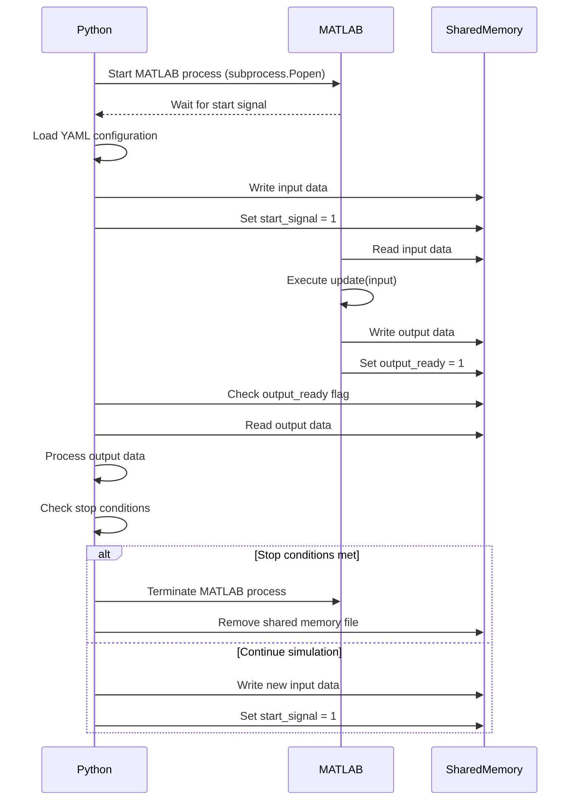

# MATLABagent Alternatives for Streaming Simulations via ICP Shared Memory

This document outlines the architecture and functionality of an integrated system that combines a Python script and a MATLAB abstract class (`SimulationWrapper`) to execute heterogeneous simulations in a coordinated manner. Communication between the two components is achieved via shared memory.

**Since MATLAB does not natively support shared memory with Python**, using a binary file provides an effective and practical solution to ensure interoperability between the two environments.

---

## 1. Python Script Functionality

### Configuration Loading

The Python script loads a YAML configuration file using the `load_config()` function. This file specifies:

- The MATLAB function to execute.
- The shared memory file (`shared_memory.bin`).
- Input data.
- Simulation stop conditions.

### Starting the MATLAB Process

The script launches MATLAB in the background using `subprocess.Popen`, executing a command that:

1. Changes the current working directory.
2. Starts the MATLAB function defined in the configuration.

### Communication via Shared Memory

- **Shared Memory File Check**: The script ensures that the `shared_memory.bin` file exists and has a minimum size of 128 bytes.
- **Writing Input Data**: Input data, read from the YAML file, is written to the shared memory in the predefined `input_data` space.
- **Start Signal Handling**: Python sends a start signal by writing to the `start_signal` byte in the shared memory.

### Data Reading and Writing

- Python waits for MATLAB to signal that output data is ready (via the `output_ready` flag).
- Once ready, Python reads the output data from the shared memory and processes it.

### Stop Conditions

The simulation stops if:

1. The output reaches a threshold value (_threshold_ condition).
2. The execution time exceeds a predefined duration (_time_ condition).

### Simulation Termination

At the end of the simulation, the Python script:

- Terminates the MATLAB process.
- Removes the shared memory file.

---

## 2. MATLAB Class `SimulationWrapper` Functionality

The abstract class `SimulationWrapper` manages the simulation and interaction with Python via shared memory. Subclasses must implement specific functions, while the base class provides shared memory management and execution logic.

### Shared Memory Initialization

The `setupSharedMemory()` function creates and maps the `shared_memory.bin` file, which contains:

- **Input Data**: `input_data`.
- **Output Data**: `output_data`.
- **Status Signals**: `input_ready`, `output_ready`, `start_signal`.
- Other flags required for simulation control.

### Start Signal Handling

The `run()` function waits for a start signal from Python (when `start_signal = 1`) and initiates the simulation.

### Input and Output Management

- MATLAB reads input data from shared memory when `input_ready = 1`.
- Executes the update operation via the `update(input)` method.
- Writes output data to shared memory and sets `output_ready = 1`.

### Simulation Termination Condition

The simulation ends when the `checkTermination()` method returns `true`. This method must be implemented in subclasses.

### Cleanup

At the end of the simulation, the `cleanup()` method releases memory and removes the shared memory file.

---

## 3. Interaction Between Python and MATLAB

The interaction flow is as follows:

1. Python starts MATLAB in the background and configures the simulation.
2. MATLAB waits for a start signal from Python.
3. Python writes input data to shared memory and sends the start signal (`start_signal = 1`).
4. MATLAB reads input data, executes the simulation, writes output data, and signals readiness (`output_ready = 1`).
5. Python reads the output data, processes it, and checks stop conditions.
6. If stop conditions are met, Python stops the simulation and terminates the MATLAB process.

---

## 4. Advantages of This Approach

- **Real-Time Simulations**: Using shared memory enables fast, low-latency interaction between Python and MATLAB, facilitating real-time simulations.

## Limitations

- **Wrapper Dependency**: The simulation structure is tightly coupled to the wrapper, requiring specific methods to be implemented in subclasses (e.g., `initialize()`, `update()`, `getOutput()`, `checkTermination()`). This creates a rigid dependency on the simulation structure, limiting flexibility.
