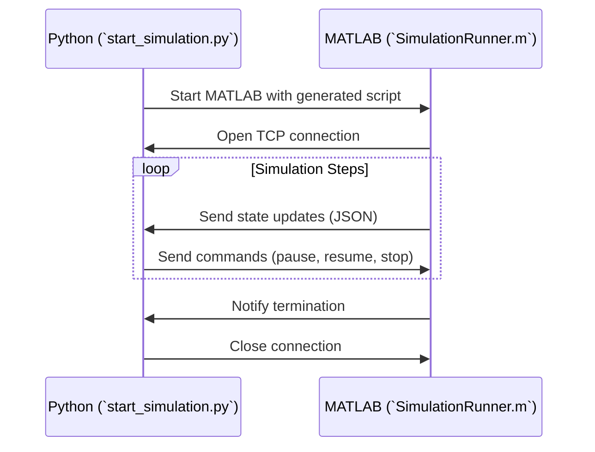

# MATLABagent alternatives for Streaming Simulations via TCP/IP

This system is designed to initiate and manage MATLAB simulations from Python, leveraging an infrastructure that combines Python and MATLAB scripts for seamless communication through TCP/IP sockets. Below is an overview of its functionality:

---

### System Overview

The process begins with the Python script `start_simulation.py`, which serves as the entry point for configuring and launching a MATLAB simulation. This script allows users to specify physical and temporal parameters via the command line, such as gravity, initial velocities, time step, and maximum simulation duration. These parameters are used to dynamically generate a MATLAB script, which is then executed in headless mode (without a graphical interface). The Python script also sets up a controller to handle communication with MATLAB and monitor the entire process.

The core of the system is the `main.py` file, which contains two primary components: the `MatlabSimulationClient` and the `SimulationController`. The `MatlabSimulationClient` manages TCP communication with MATLAB, receiving data and sending commands. It can interpret JSON messages from MATLAB, update the simulation state, and respond to events such as pauses, resumes, or terminations. The `SimulationController` orchestrates the entire simulation lifecycle, starting the Python server, executing the MATLAB script, and managing user commands via the console.

On the MATLAB side, the `SimulationRunner.m` file provides the infrastructure to execute the simulation and communicate with Python. This class is designed to be highly modular, allowing specific functions to be exported and reused in other simulations. This approach significantly reduces coupling between simulations and the system, making the code more flexible and reusable. `SimulationRunner.m` handles the simulation lifecycle, from initialization to data exchange with Python, and termination. Each event, such as the start or end of a simulation step, is notified to Python via JSON messages, ensuring precise synchronization between the two environments.

---

### Communication Flow

1. **Initialization**: `start_simulation.py` starts the Python server and launches MATLAB with a dynamically generated script.
2. **Connection**: MATLAB initializes `SimulationRunner`, which opens a TCP socket to the Python client.
3. **Data Exchange**: MATLAB sends events (initialization, state updates, step completions) to Python as JSON messages. Python, in turn, sends commands such as pause, resume, or stop.
4. **Termination**: Both sides gracefully close the connection and terminate their processes.

---

### Benefits

- `SimulationRunner.m` is modular and independent of specific simulations, enabling the integration of new models by implementing functions in separate modules. This reduces coupling between the communication core and simulations, improving extensibility.

### Limitations

- TCP/IP communication latency may impact performance, making it less efficient for data-intensive applications.
