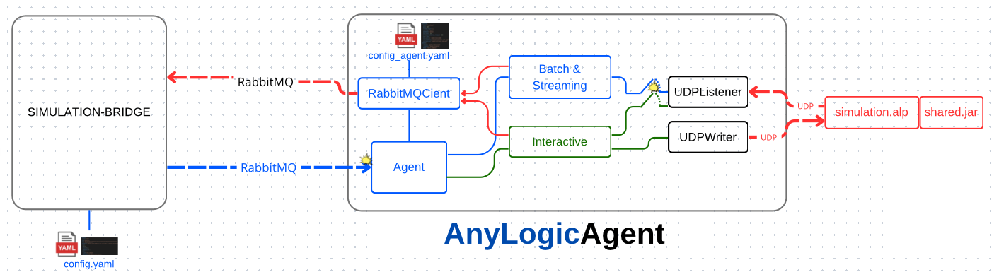
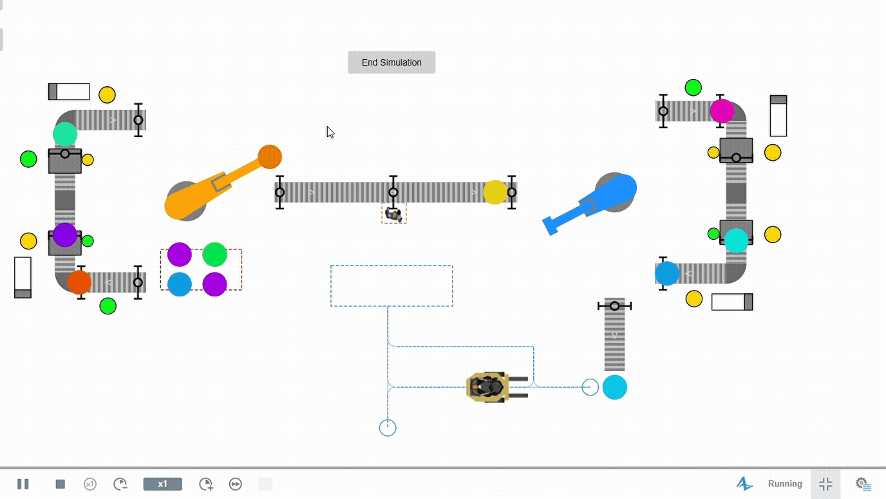

# AnyLogic Agent

The AnyLogic Agent is a Python-based connector designed to interface with AnyLogic simulations via the Simulation Bridge. It enables seamless integration with the [_sim_bridge_](../../README.md) and can also be used by external systems through RabbitMQ exchanges. All communication parameters and settings are managed via a YAML configuration file.

<p align="center">
  <br>
</p>

> Explore the **[Smart Factory 4.0 example](anylogic_agent/docs/examples/smart_factory_4.0/README.md)** to see the AnyLogic Agent in action 🔥
>
> <p align="center">
>   
> </p>

## Table of Contents

- [AnyLogic Agent](#anylogic-agent)
  - [Table of Contents](#table-of-contents)
  - [Requirements](#requirements)
    - [Installation](#installation)
      - [1. Clone the Repository and Navigate to the Working Directory](#1-clone-the-repository-and-navigate-to-the-working-directory)
      - [2. Install Poetry and Create Virtual Environment](#2-install-poetry-and-create-virtual-environment)
      - [3. Install Project Dependencies](#3-install-project-dependencies)
    - [Configuration](#configuration)
  - [Usage](#usage)
    - [Getting Started](#getting-started)
    - [Running the Agent](#running-the-agent)
  - [Distributing the Package as a PIP Package with Poetry](#distributing-the-package-as-a-pip-package-with-poetry)
    - [Verifying the Package](#verifying-the-package)
    - [Releasing a New Version](#releasing-a-new-version)
  - [Quick Start: Client Interaction](#quick-start-client-interaction)
  - [Documentation](#documentation)
  - [Package Development](#package-development)
  - [Author](#author)

## Requirements

### Installation

#### 1. Clone the Repository and Navigate to the Working Directory

```bash
git clone https://github.com/INTO-CPS-Association/simulation-bridge.git
cd simulation-bridge/agents/anylogic
```

#### 2. Install Poetry and Create Virtual Environment

```bash
python3 -m pip install --user pipx
python3 -m pipx ensurepath
pipx install poetry
poetry --version

# Activate the environment
poetry env use python3
poetry shell
```

Verify the active Python interpreter:

```bash
which python
python --version
```

#### 3. Install Project Dependencies

```bash
poetry install
```

### Configuration

The agent requires a YAML configuration file. You can generate a default configuration file using:

```bash
poetry run anylogic-agent --generate-config
```

This creates `config.yaml` in the current directory if it does not exist.

Example configuration (`config.yaml`):

```yaml
agent:
  agent_id: anylogic
  simulator: anylogic

rabbitmq:
  host: localhost
  port: 5672
  username: guest
  password: guest
  heartbeat: 600
  vhost: /
  tls: false

simulation:
  path: /path/to/examples

exchanges:
  input: ex.bridge.output
  output: ex.sim.result

queue:
  durable: true
  prefetch_count: 1

logging:
  level: INFO
  file: logs/anylogic_agent.log

udp:
  host: localhost
  output_port: 9876
  input_port: 9877

response_templates:
  success:
    status: success
    simulation:
      type: batch
    timestamp_format: "%Y-%m-%dT%H:%M:%SZ"
    include_metadata: true
    metadata_fields: [execution_time, memory_usage]
  error:
    status: error
    include_stacktrace: false
    error_codes:
      invalid_config: 400
      execution_error: 500
      timeout: 504
      missing_file: 404
    timestamp_format: "%Y-%m-%dT%H:%M:%SZ"
  progress:
    status: in_progress
    include_percentage: true
    update_interval: 5
    timestamp_format: "%Y-%m-%dT%H:%M:%SZ"
```

## Usage

### Getting Started

To generate all necessary project files for your AnyLogic simulation, run:

```bash
poetry run anylogic-agent --generate-project
```

This will create:

- `config.yaml`: Configuration file for the agent
- `client/use_anylogic_agent_streaming.py`: Example client script for streaming simulations
- `client/use_anylogic_agent_interactive.py`: Example client script for interactive simulations
- `client/use.yaml`: YAML configuration for the example client script
- `client/simulation.yaml`: YAML template for defining simulations
- `client/README.md`: Instructions for using the example client scripts
- `template/README.md`: Instructions for using the template and starting development
- `template/template.alp`: Base AnyLogic project file
- `template/shared.jar`: Java library for UDP communication

### Running the Agent

Default usage (expects `config.yaml` in the current directory):

```bash
poetry run anylogic-agent
```

To specify a custom configuration file:

```bash
poetry run anylogic-agent --config-file path/to/config.yaml
```

## Distributing the Package as a PIP Package with Poetry

Build the package from `agents/anylogic`:

```bash
poetry build
```

Artifacts will be created in the `dist/` directory.

### Verifying the Package

```bash
pip install dist/anylogic_agent-<version>-py3-none-any.whl
anylogic-agent --help
```

### Releasing a New Version

Update the version in `pyproject.toml`, then build and publish as needed.

## Quick Start: Client Interaction

Refer to the example client scripts in the `client/` directory for guidance on interacting with the AnyLogic Agent. For detailed setup and usage instructions, see the [Quick Start README](anylogic_agent/resources/README.md).

## Documentation

- [**Anylogic Template** ↗](anylogic_agent/resources/TEMPLATE.md): Explanation of the Anylogic agent functionality and configuration.
- [**Anylogic Simulation Constraints** ↗](anylogic_agent/docs/README.md): A breakdown of the constraints and requirements for Anylogic-driven simulations.
- [**Smart Factory 4.0 Example** ↗](anylogic_agent/docs/examples/smart_factory_4.0/README.md): A comprehensive example of a Smart Factory simulation model using the AnyLogic Agent.

## Package Development

Run tests and code checks:

```bash
pytest
pylint anylogic_agent
autopep8 --in-place --aggressive --recursive anylogic_agent
```

## Author

<div style="display: flex; flex-direction: column; gap: 25px;">
  <!-- Marco Melloni -->
  <div style="display: flex; align-items: center; gap: 15px;">
    
    <div>
      <h3 style="margin: 0;">Marco Melloni</h3>
      <p style="margin: 4px 0;">Digital Automation Engineering Student<br> University of Modena and Reggio Emilia, Department of Sciences and Methods for Engineering (DISMI)</p>
      <div>
        <a href="https://www.linkedin.com/in/marco-melloni/">
          
        </a>
        <a href="https://github.com/marcomelloni" style="margin-left: 8px;">
          
        </a>
      </div>
    </div>
  </div>
  <!-- Marco Picone -->
  <div style="display: flex; align-items: center; gap: 15px;">
    
    <div>
      <h3 style="margin: 0;">Prof. Marco Picone</h3>
      <p style="margin: 4px 0;">Associate Professor<br> University of Modena and Reggio Emilia, Department of Sciences and Methods for Engineering (DISMI)</p>
      <div>
        <a href="https://www.linkedin.com/in/marco-picone-8a6a4612/">
          
        </a>
        <a href="https://github.com/piconem" style="margin-left: 8px;">
          
        </a>
      </div>
    </div>
  </div>
  <!-- Prasad Talasila -->
  <div style="display: flex; align-items: center; gap: 15px;">
    
    <div>
      <h3 style="margin: 0;">Dr. Prasad Talasila</h3>
      <p style="margin: 4px 0;">Postdoctoral Researcher<br> Aarhus University</p>
      <div>
        <a href="https://www.linkedin.com/in/prasad-talasila/">
          
        </a>
        <a href="https://github.com/prasadtalasila" style="margin-left: 8px;">
          
        </a>
      </div>
    </div>
  </div>
  <!-- Davide Ziglioli -->
  <div style="display: flex; align-items: center; gap: 15px;">
    
    <div>
      <h3 style="margin: 0;">Davide Ziglioli</h3>
      <p style="margin: 4px 0;">Digital Automation Engineering Graduated Student<br> University of Modena and Reggio Emilia, Department of Sciences and Methods for Engineering (DISMI)</p>
      <div>
        <a href="https://www.linkedin.com/in/davide-ziglioli/">
          
        </a>
        <a href="https://github.com/davide-z99" style="margin-left: 8px;">
          
        </a>
      </div>
    </div>
  </div>
</div>
