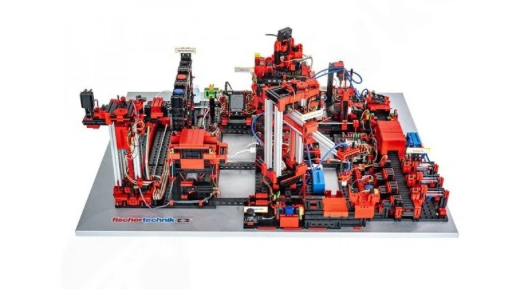
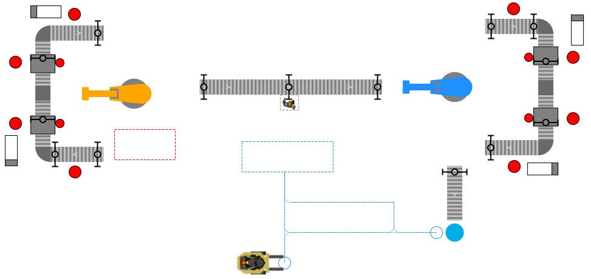
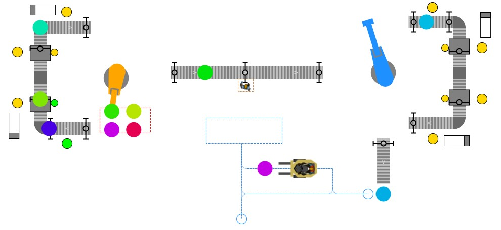
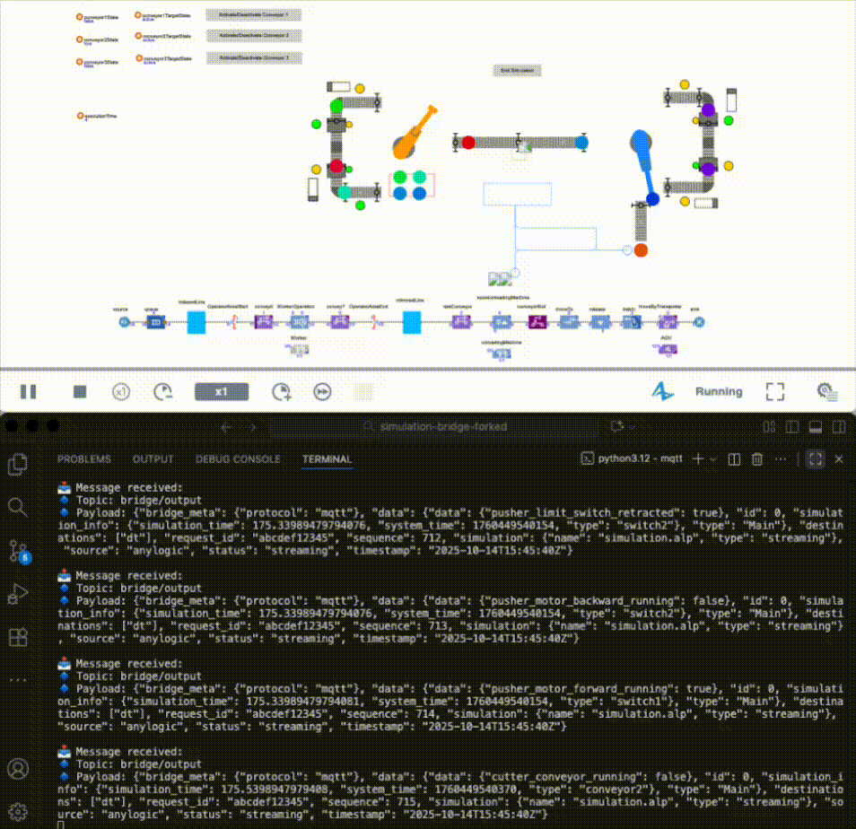
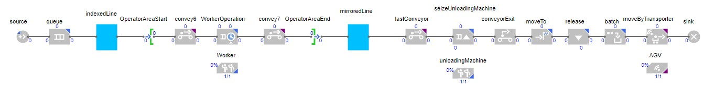
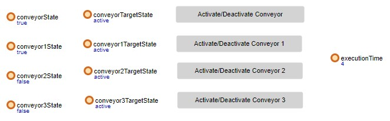

# Smart Factory Simulation Model

This AnyLogic simulation model reproduces the physical layout and logic of the **[Fischertechnik Training Factory Industry 4.0 (24V)](https://www.fischertechnik.de/en/products/industry-and-universities/training-models/554868-training-factory-industry-4-0-24v)**, a modular Industry 4.0 training factory used for education and research purposes.

#### About the Physical System

The Fischertechnik Training Factory is a small-scale smart factory that demonstrates digitized production processes in real-time, featuring:

- Storage and retrieval units
- Vacuum gripper robot arms
- Sensor-equipped conveyors
- Processing stations (drilling, cutting, etc.)

## Model Description

This example presents a **two-dimensional Smart Factory model** built using AnyLogic's **Material Handling Library**. The simulation models a complete automated production line while evaluating the **communication overhead** of bidirectional data exchange between the **Digital Twin (DT)** and the simulation environment.

  

  
  

  Smart Factory 4.0&nbsp;&nbsp;|&nbsp;&nbsp; Working Smart Factory 4.0

**Results from the simulation can be achieved in real-time through the AnyLogic Agent and the [Simulation Bridge](https://github.com/INTO-CPS-Association/simulation-bridge):**

  

  AnyLogic Agent & Simulation Bridge | Working Smart Factory 4.0

## Execution Modes

The simulation supports two distinct operating modes:

**Streaming Mode**  
The model runs continuously and transmits real-time production data (sensor readings, machine states, throughput metrics) to external systems, mimicking how a live digital twin feeds information to monitoring dashboards or analytics platforms.

**Interactive Mode**  
Users can actively control and modify simulation parameters during runtime, such as adjusting robotic arm speeds, toggling conveyor operations, or changing processing times at workstations.

## Production Line Overview

The Smart Factory model replicates a realistic industrial production flow, including:

- **Robotic arms**
- **Conveyors**
- **Pushers / Transfer stations**
- **Workstations** (Drilling and Cutting machines)
- **Photo cells**
- **Product flow management**

The simulation integrates all these entities to create a unified digital environment where physical processes and their digital counterparts interact in real time.

## System Workflow

1. **Initialization**  
   The process begins when a **robotic arm** (modeled with the _AnyLogic Robot element_) places a **simulation agent** at the start of the first conveyor.

2. **Detection and Movement**  
   A **photo cell** detects the agent and triggers the conveyor to start.  
   When the agent leaves the conveyor, another photo cell detects the empty state and stops the conveyor automatically.

3. **Pusher Simulation**  
   In the absence of dedicated pushers, **transfer stations** combined with a **custom-designed switch** emulate their functionality.  
   These components send **position-change messages** to the **Simulation Bridge**, replicating pusher behavior.

4. **Machine Operations**

   - The **drilling machine** stops the product mid-conveyor for processing.
   - Once drilling is complete, the conveyor restarts and moves the agent to the **cutter machine**, which performs the final operation.

5. **End of Line**  
   A final **photo cell** signals the **robotic arm** to pick up the product and move it to the next Smart Factory section.

## Simulation Logic

  

The production process is implemented using a **block diagram** structure that manages each stage of the simulation.

| Block                         | Description                                             |
| ----------------------------- | ------------------------------------------------------- |
| **Source**                    | Generates agents at a rate of 6 per minute              |
| **Queue**                     | Simulates the maximum pallet capacity                   |
| **ProcessByRobot**            | Defines pick-and-place tasks, timing, and state updates |
| **Convey**                    | Controls agent movement along each conveyor section     |
| **Service**                   | Models workstation operations and message transmission  |
| **Restricted Area Start/End** | Limits one agent per conveyor or workstation            |
| **Sink**                      | Removes agents at the end of the process                |

## Visual Feedback and Controls

  

To enhance user understanding of the simulation state:

- **Stoplights** indicate machine activity:  
  🟢 _Green_ → Machine active  
  🟡 _Yellow_ → Waiting for next agent
- **Boolean variables** represent conveyor states (`true` = running, `false` = stopped).
- **Manual control buttons** allow users to start or stop each conveyor individually and to end the simulation.
- **ExecutionTime** represents the time spent by the robot to perform its tasks of pick-and-place.

## Technologies and Tools

- **AnyLogic Material Handling Library**
- **DT Simulation Bridge** (custom communication interface)
- **Custom logic components** for position detection and message transmission
