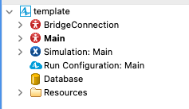
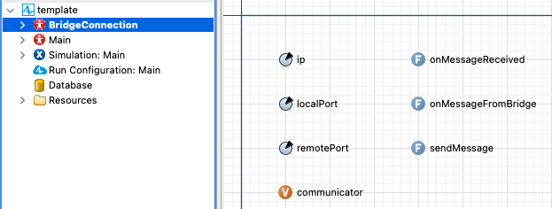
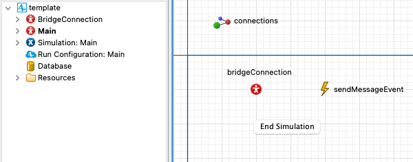
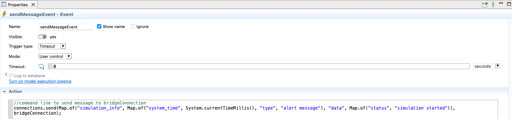
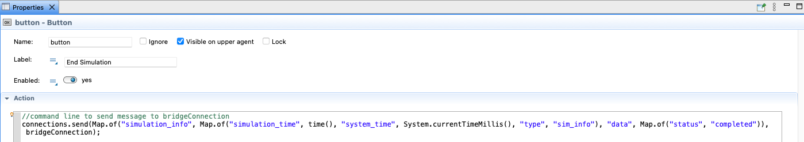

### Anylogic Template

The `template.alp` file is a preconfigured Anylogic project designed to integrate simulation with the Anylogic Agent.

The `shared.jar` library contains the necessary Java classes for UDP communication between the Anylogic simulation and the Anylogic Agent. Ensure this file is in the same directory as the `.alp` file.

The template includes two main agents:

- **Main**: the primary simulation agent (see Figure 1).
- **BridgeConnection**: manages UDP communication with the Anylogic Agent (see Figure 2).

<p align="center">
	<br>
	<em>Figure 1 - Agent structure in Anylogic simulation</em>
</p>

The **BridgeConnection** agent (Figure 2) defines two main events:

<p align="center">
	<br>
	<em>Figure 2 - BridgeConnection agent details</em>
</p>

- `onMessageReceived`: handles simulation results to be sent to the Agent.
- `onMessageFromBridge`: handles incoming messages from the Anylogic Agent.

To send a message from the simulation to the Anylogic Agent, use the function `connections.send(payload, bridgeConnection);`, where `payload` is a map (`Map<String, Object>`) describing the update to send, and `bridgeConnection` is the agent responsible for UDP communication. The `connections` channel is native to Anylogic and enables message transmission between agents.

**Example of sending a message:**

```java
connections.send(
		Map.of("simulation_info",
				Map.of("system_time", System.currentTimeMillis(),
							 "type", "alert message"),
				"data", Map.of("status", "simulation started")),
		bridgeConnection
);
```

**Example of a message received from the client via the Anylogic Agent:**

```json
{
  "...": "...",
  "data": {
    "data": { "status": "simulation started" },
    "id": 0,
    "simulation_info": {
      "system_time": 1759408693888,
      "type": "alert message"
    },
    "type": "Main"
  },
  "...": "..."
}
```

In Anylogic, the `Map` data structure associates keys (`String`) with values (`Object`). In the example, the map contains the keys `simulation_info` and `data`, which include simulation information and transmitted data.

The **BridgeConnection** agent (Figure 2) includes three parameters: IP address, local port, and remote port, required for message publishing. These parameters must match those configured in the Anylogic Agent's `config.yaml` file. There is also a `communicator` variable, which is not yet initialized.

<p align="center">
	<br>
	<em>Figure 3 - Main agent details</em>
</p>

The **Main** agent (Figure 3) includes the preconfigured `BridgeConnection` component, already connected to Anylogic's `connections` channel, enabling message transmission between agents. An example event, `sendMessageEvent`, sends a message at the start of the simulation (Figure 4).

<p align="center">
	<br>
	<em>Figure 4 - sendMessageEvent in Main agent</em>
</p>

There is also a preconfigured **end simulation** button (Figure 5), which allows you to terminate the simulation when clicked.

<p align="center">
	<br>
	<em>Figure 5 - end simulation button in Main agent</em>
</p>

To end the simulation and communication with the agent, send a UDP message with the following structure:

```java
connections.send(
		Map.of("status", "completed"),
		bridgeConnection
);
```

When the agent receives a `completed` status, it terminates UDP communication with the current simulation and waits for a new request.

There are no further constraints on the implementation. The function should be designed to meet the specific requirements of the simulation scenario.
