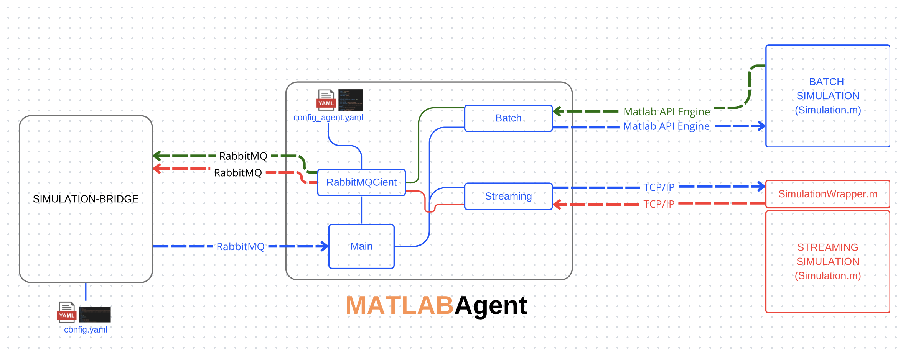

# MATLAB agent

The MATLAB Agent is a Python-based connector designed to interface with MATLAB simulations through various methods. It provides the following functionalities:

- **Batch Simulation**: Executes predefined MATLAB routines with specified input parameters, collecting the final results upon completion.
- **Streaming Simulation (Agent-Based)**: Allows sending input once, with the output being received in real-time during the simulation.

The MATLAB Agent is primarily built to integrate with the Simulation Bridge but can also be utilized by external systems via RabbitMQ exchange methods. Communication parameters and other settings are defined in the configuration file located at `matlab_agent/config/config.yaml`.

<div align="center">
  
</div>

## Requirements

#### 1. Clone the Repository and Navigate to the Working Directory

```bash
git clone https://github.com/INTO-CPS-Association/simulation-bridge.git
cd simulation-bridge
```

### 2. Install Poetry and Create Virtual Environment

Ensure that Poetry is installed on your system. If it is not already installed, execute the following commands:

```bash
python3 -m pip install --user pipx
python3 -m pipx ensurepath
pipx install poetry
```

Verify the installation by checking the Poetry version:

```bash
poetry --version
```

Activate the virtual environment:

```bash
poetry env activate
```

> **Important:**  
> The command `poetry env activate` does not automatically activate the virtual environment; instead, it prints the command you need to run to activate it.  
> You must copy and paste the displayed command, for example:

```bash
source /path/to/virtualenv/bin/activate
```

Verify that the environment is active by checking the Python path:

```bash
which python
```

#### 3. Install Project Dependencies

Run the following command to install all dependencies defined in `pyproject.toml`:

```bash
poetry install
```

#### 4. Install the MATLAB Engine API for Python

To connect MATLAB to the Simulation Bridge, you need to install the MATLAB Engine API within the Poetry environment. There are two possible methods to integrate Matlab engine into python virtual environment.

##### 4.1 Installation using in-built Python package

The Matlab installation comes with python pip package which can be used. Assuming you are using MATLAB R2024b and MacOS, execute the following commands:

```bash
cd /Applications/MATLAB_R2024b.app/extern/engines/python
poetry run python -m pip install .
```

> **Note:** Replace `MATLAB_R2024b.app` with the version of MATLAB installed on your system.

##### 5.2 Install pip package

There is a pip package named [matlabengine](https://pypi.org/project/matlabengine) for Matlab.
Each version of this package is meant for a specific version of Matlab. You can see the [matlabengine package history](https://pypi.org/project/matlabengine/#history) and select the compatible pip package. Install the package for `Matlab_R2024b` release.

```bash
pip install matlabengine==24.2.2
```

#### 5. Verify the MATLAB Engine Installation

To ensure the installation was successful, run:

```bash
poetry run python -c "import matlab.engine; print('MATLAB Engine is installed successfully')"
```

If everything is correct, you should see the message:

```
MATLAB Engine is installed successfully!
```

Ensure that the MATLAB Engine is properly installed and accessible within your Python environment before proceeding.

### Configuration

The configuration is specified in yaml format. A template file (`matlab_agent/config/config.yaml.template`) has been provided. It can be customized further.

Explanation on different fields of the yaml template is given below.

```yaml
agent:
  agent_id: matlab # Specifies the unique identifier for the agent. This ID is used to distinguish the agent in the system.

rabbitmq:
  host: localhost # The hostname or IP address of the RabbitMQ server.
  port: 5672 # The port number for RabbitMQ communication (default is 5672).
  username: guest # The username for authenticating with RabbitMQ.
  password: guest # The password for authenticating with RabbitMQ.
  heartbeat: 600 # The heartbeat interval (in seconds) to keep the connection alive.
  vhost: / # The virtual host to use for RabbitMQ connections.

simulation:
  path: /Users/foo/simulation-bridge/agents/matlab/matlab_agent/docs/examples # The file path to the folder containing MATLAB simulation files.

exchanges:
  input: ex.bridge.output # The RabbitMQ exchange from which the agent receives commands.
  output: ex.sim.result # The RabbitMQ exchange to which the agent sends simulation results.

queue:
  durable: true # Ensures that the queue persists across RabbitMQ broker restarts.
  prefetch_count: 1 # Limits the number of unacknowledged messages the agent can receive at a time.

logging:
  level: INFO # Specifies the logging level. Options include DEBUG, INFO, and ERROR.
  file: logs/matlab_agent.log # The file path where logs will be stored.

tcp:
  host: localhost # The hostname or IP address for TCP communication.
  port: 5678 # The port number for TCP communication.

response_templates:
  success:
    status: success # Indicates a successful simulation response.
    simulation:
      type: batch # Specifies the type of simulation (e.g., batch or streaming).
    timestamp_format: "%Y-%m-%dT%H:%M:%SZ" # The timestamp format in ISO 8601 with a Z suffix for UTC.
    include_metadata: true # Determines whether metadata is included in the response.
    metadata_fields: # Specifies the metadata fields to include in the response.
      - execution_time
      - memory_usage
      - matlab_version

  error:
    status: error # Indicates an error response.
    include_stacktrace: false # For security, stack traces are excluded in production environments.
    error_codes: # Maps specific error scenarios to HTTP-like status codes.
      invalid_config: 400 # Error code for invalid configuration.
      matlab_start_failure: 500 # Error code for MATLAB startup failure.
      execution_error: 500 # Error code for simulation execution errors.
      timeout: 504 # Error code for simulation timeout.
      missing_file: 404 # Error code for missing files.

    timestamp_format: "%Y-%m-%dT%H:%M:%SZ" # The timestamp format in ISO 8601 with a Z suffix for UTC.

  progress:
    status: in_progress # Indicates that the simulation is currently in progress.
    include_percentage: true # Includes the percentage of completion in progress updates.
    update_interval: 5 # Specifies the interval (in seconds) for sending progress updates.
    timestamp_format: "%Y-%m-%dT%H:%M:%SZ" # The timestamp format in ISO 8601 with a Z suffix for UTC.
```

```bash
poetry run matlab-agent --config-file <path_to_config.yaml>
```

## Usage

The agent requires a configuration file to run. You can start by copying the provided template and customizing it as needed.

### Getting Started

1. Generate a configuration file template:

```bash
poetry run matlab-agent --generate-config
```

This creates a `config.yaml` file in your current directory that you can customize.

2. Generate all necessary project files:

```bash
poetry run matlab-agent --generate-project
```

This creates the following files:

- `config.yaml` - Configuration settings
- `SimulationWrapper.m` - Main interface for MATLAB simulations
- `SimulationBatch.m` - Template for batch simulations
- `SimulationStreaming.m` - Template for streaming simulations

3. Customize these files according to your simulation needs.

### Running the Agent

To start the MATLAB Agent with the default configuration:

```bash
poetry run matlab-agent
```

To use a custom configuration file:

```bash
poetry run matlab-agent --config-file <path_to_config.yaml>
```

Or use the shorthand:

```bash
poetry run matlab-agent -c <path_to_config.yaml>
```

## Distributing the Package as a PIP Package with Poetry

To create the package, run the following command in the project's root directory (where `pyproject.toml` is located):

```bash
poetry build
```

This will generate two files in the `dist/` folder:

- A `.whl` file → (Wheel Package).
- A `.tar.gz` file → (Source Archive).

Example output:

```bash
dist/
├── matlab_agent-0.1.0-py3-none-any.whl
└── matlab_agent-0.1.0.tar.gz
```

### Verifying the Package (Optional but Recommended)

You can verify that the package works by installing it locally:

```bash
pip install dist/matlab_agent-0.1.0-py3-none-any.whl
```

Then, run the command defined in the script:

```bash
matlab-agent
```

### Releasing a New Version

When you modify the code and want to release a new version, increment the version number in `pyproject.toml`:

```toml
version = "0.2.0"
```

Then rebuild the package:

```bash
poetry build
```

## Demonstration

For instructions on running tests created with `pytest` and `unittest.mock`, please refer to the [Tests Documentation](matlab_agent/tests/README.md).

## Quick Start: Interacting with the Matlab agent

To quickly begin using the MATLAB Agent, a demonstration script (`resources/use_matlab_agent.py`) has been provided.

The script requires a configuration file. You can copy the `matlab_agent/resources/use.yaml.template` into `matlab_agent/resources/use.yaml` and customize it.

```bash
cd matlab_agent/resources
python use_matlab_agent.py
```

This script demonstrates how to interact with the MATLAB Agent, providing a clear example of its functionality and integration process.

## Workflow

1. The agent connects to RabbitMQ and sets up the required queues and exchanges.
2. It listens for incoming messages on its dedicated queue.
3. Upon receiving a message:

- It analyzes and processes the simulation request.
- Executes the simulation.
- Sends the results to the output exchange.

For detailed information regarding simulations and constraints, please refer to the [Simulations and Constraints Documentation](matlab_agent/docs/README.md).

## Package Development

The developer-specific commands are

```bash
pytest
pylint matlab_agent
autopep8 --in-place --aggressive --recursive 'matlab_agent'
```

## Author

<div style="display: flex; flex-direction: column; gap: 25px;"> <!-- Marco Melloni --> <div style="display: flex; align-items: center; gap: 15px;">  <div> <h3 style="margin: 0;">Marco Melloni</h3> <p style="margin: 4px 0;">Digital Automation Engineering Student<br> University of Modena and Reggio Emilia, Department of Sciences and Methods for Engineering (DISMI)</p> <div> <a href="https://www.linkedin.com/in/marco-melloni/">  </a> <a href="https://github.com/marcomelloni" style="margin-left: 8px;">  </a> </div> </div> </div> <!-- Marco Picone --> <div style="display: flex; align-items: center; gap: 15px;">  <div> <h3 style="margin: 0;">Prof. Marco Picone</h3> <p style="margin: 4px 0;">Associate Professor<br> University of Modena and Reggio Emilia, Department of Sciences and Methods for Engineering (DISMI)</p> <div> <a href="https://www.linkedin.com/in/marco-picone-8a6a4612/">  </a> <a href="https://github.com/piconem" style="margin-left: 8px;">  </a> </div> </div> </div> <!-- Prasad Talasila --> <div style="display: flex; align-items: center; gap: 15px;"> <!-- Placeholder image -->  <div> <h3 style="margin: 0;">Dr. Prasad Talasila</h3> <p style="margin: 4px 0;">Postdoctoral Researcher<br> Aarhus University</p> <div> <a href="https://www.linkedin.com/in/prasad-talasila/">  </a> <a href="https://github.com/prasadtalasila" style="margin-left: 8px;">  </a> </div> </div> </div> </div>
