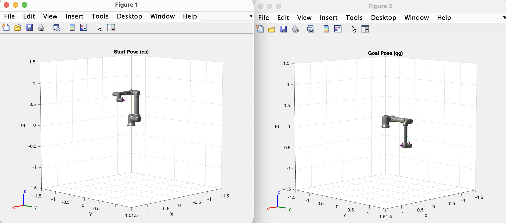
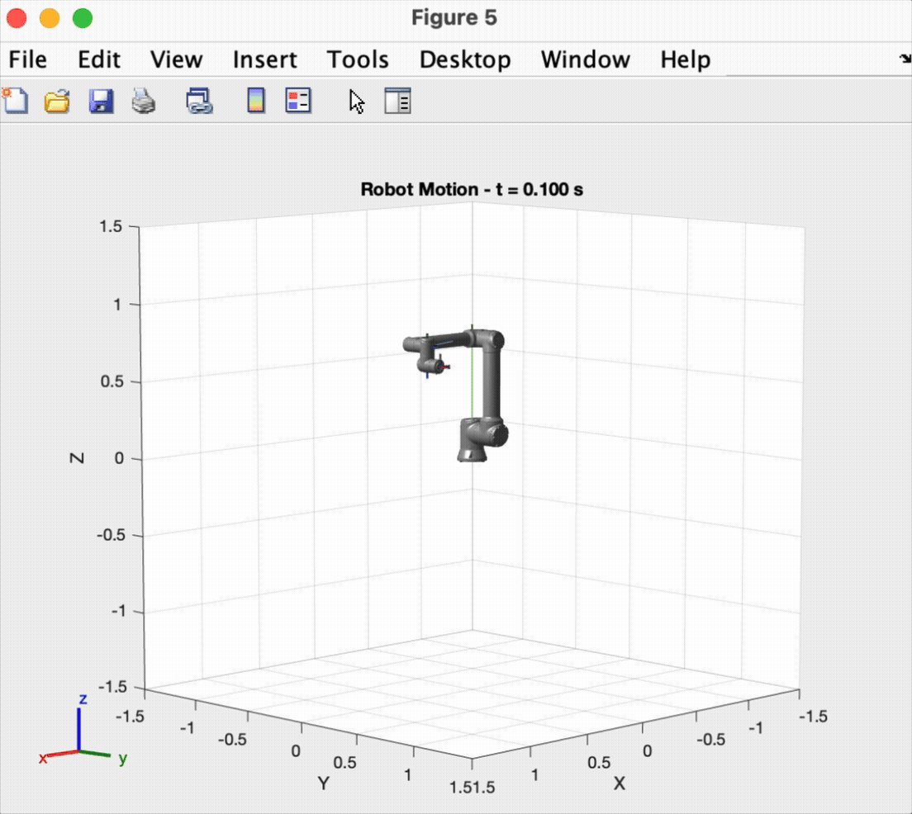

# Joint Space Control with Quintic Trajectory Tracking

This MATLAB simulation generates smooth trajectories for a Universal Robots UR10e robotic arm using quintic (5th-order) polynomials in joint space. The robot smoothly moves from a starting joint configuration to a target configuration, following an optimally timed trajectory with continuous position, velocity, and acceleration profiles.





- **Quintic Polynomial Trajectory Generation**: Ensures smooth motion with continuous position, velocity, and acceleration
- **Proportional Feedback Control**: Tracks the desired trajectory using a simple P-controller
- **Velocity Feedforward**: The controller adds the desired joint velocity to the command to reduce lag and tracking error during motion
- **Real-time Visualization**: Displays robot motion, joint trajectories, and tracking errors
- **Configurable Parameters**: Customize start/goal poses, duration, and time step

## Requirements

- MATLAB R2019b or later
- Robotics System Toolbox
- Universal Robots UR10e model (included in Robotics System Toolbox)

## Usage

### Input Parameters

| Parameter | Type       | Description                                | Default Value             |
| --------- | ---------- | ------------------------------------------ | ------------------------- |
| `qs`      | 6×1 vector | **Start joint configuration** [rad or deg] | `[0; -π/2; π/2; 0; 0; 0]` |
| `qg`      | 6×1 vector | **Goal joint configuration** [rad or deg]  | `[π/2; 0; π/2; 0; π; π]`  |
| `tf`      | scalar     | **Total trajectory duration** [s]          | `3`                       |
| `showGui` | boolean    | **Enable visualization** (true/false)      | `true`                    |
| `ts`      | scalar     | **Simulation time step** [s]               | `0.005`                   |

**Notes:**

- Joint angles can be provided in **radians** or **degrees** (auto-detected)
- All input vectors are automatically converted to column format
- If values exceed 2π, they are assumed to be in degrees and converted to radians

### Output Structure

The function returns a structure `outputs` containing:

| Field               | Dimension | Description                                                  |
| ------------------- | --------- | ------------------------------------------------------------ |
| `desired_positions` | 6×N       | Desired joint positions sampled at 10× time step [rad]       |
| `actual_positions`  | 6×N       | Actual joint positions sampled at 10× time step [rad]        |
| `time`              | 1×N       | Time vector corresponding to sampled data [s]                |
| `velocities`        | 6×M       | Commanded joint velocities at each control step [rad/s]      |
| `tracking_error`    | 1×M       | Euclidean norm of tracking error at each time step [rad]     |
| `final_error`       | scalar    | Final tracking error between goal and reached position [rad] |
| `final_position`    | 6×1       | Final joint configuration reached by the robot [rad]         |

_N = number of sampled points (every 10th time step)_  
_M = total number of simulation time steps_

## How It Works

### 1. Trajectory Generation

For each joint, a **quintic polynomial** is computed to smoothly interpolate between start and goal positions:

```
q(t) = a₀ + a₁t + a₂t² + a₃t³ + a₄t⁴ + a₅t⁵
```

Boundary conditions enforce:

- Zero velocity at start and end: `q̇(0) = 0`, `q̇(tf) = 0`
- Zero acceleration at start and end: `q̈(0) = 0`, `q̈(tf) = 0`

### 2. Control Law

The controller uses **proportional feedback with velocity feedforward**:

```
u = dqd + K · (qd - q)
```

Where:

- `qd` and `dqd` are the desired joint position and velocity from the quintic trajectory;
- `q` is the current joint position;
- `K = 100·I₆` is the proportional gain matrix;
- `u` is the commanded joint velocity.

**Why feedforward?**  
The proportional term `K(qd - q)` corrects the error, but introduces delay (lag) when the trajectory is moving. Adding the **feedforward** term `dqd` provides the control chain with the "right" velocity that the trajectory requires at that instant, reducing:

- lag during the tracking phase,
- transient tracking error,
- error peaks during accelerations/slope changes.

### 3. Integration

Joint positions are updated using Euler integration:

```
q(t+Δt) = q(t) + u·Δt
```

With `u = dqd + K(qd - q)`, the `dqd` part anticipates the movement required by the trajectory, while `K(qd - q)` cancels the residual error.
The simulation continues until the trajectory time is reached **and** the final error is below threshold (`1e-5` rad).

## Visualization

When `showGui = true`, the simulation generates four figures:

1. **Start Pose**: Initial robot configuration
2. **Goal Pose**: Target robot configuration
3. **Joint Trajectories**: Position vs. time for all 6 joints with desired waypoints
4. **Tracking Error**: Euclidean norm of error over time
5. **Animated Motion**: Real-time 3D visualization of robot movement

## Configuration

### Adjusting Control Performance

Modify the proportional gain in the code:

```matlab
K = 100 * eye(6);  % Increase for faster tracking, decrease if oscillations occur
```

### Changing Sampling Rate

Output data is sampled at 10× the simulation time step. To modify:

```matlab
sampling_rate = 10;  % Change to desired sampling factor
```

## Mathematical Background

The quintic polynomial ensures **jerk-limited motion**, which is important for:

- Reducing mechanical wear on joints
- Minimizing vibrations and oscillations
- Ensuring smooth, natural-looking robot motion

The polynomial coefficients are computed using the `polynomialfit` function with boundary conditions for position, velocity, and acceleration at both endpoints.

## Troubleshooting

| Issue                    | Solution                                                                  |
| ------------------------ | ------------------------------------------------------------------------- |
| Robot doesn't reach goal | Increase `tf` or proportional gain `K`                                    |
| Oscillations in motion   | Decrease proportional gain `K`                                            |
| Slow visualization       | Reduce animation sampling (change `1:10:length(time_sim)` to larger step) |
| Input dimension errors   | Ensure `qs` and `qg` are 6-element vectors                                |
