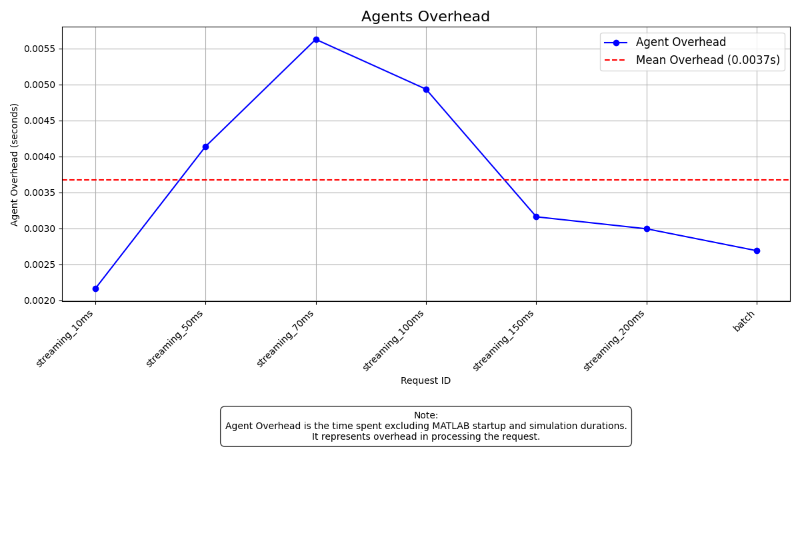
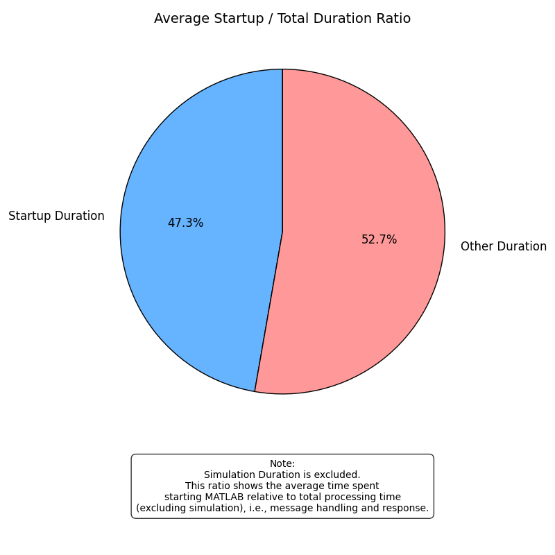
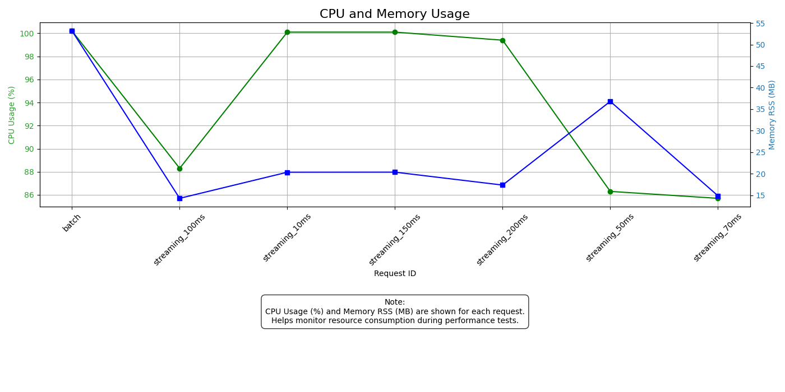

# Performance Analysis Report

Here is a concise summary of the key performance metrics averaged over all requests:

> **Mean Agent Overhead:** `0.0037 seconds`

> **Mean Startup / Total Duration Ratio:** `0.4725`

> **Mean CPU Usage:** `94.30%`

> **Mean Memory RSS:** `25.31 MB`

## Agent Overhead by Operation ID

Agent Overhead is the time spent processing a request _excluding_ MATLAB startup and simulation durations. This metric helps identify the processing overhead for each operation.

| Operation ID    | Agent Overhead (s) |
| --------------- | ------------------ |
| streaming_10ms  | 0.0022             |
| streaming_50ms  | 0.0041             |
| streaming_70ms  | 0.0056             |
| streaming_100ms | 0.0049             |
| streaming_150ms | 0.0032             |
| streaming_200ms | 0.0030             |
| batch           | 0.0027             |

**Mean Agent Overhead:** 0.0037 seconds

## Startup / Total Duration Ratio (Batch Requests)

This ratio represents the proportion of time spent starting MATLAB relative to total processing time (excluding simulation). A higher ratio indicates more startup overhead per request.

| Operation ID    | Startup / Total Ratio |
| --------------- | --------------------- |
| streaming_10ms  | 0.6143                |
| streaming_50ms  | 0.5652                |
| streaming_70ms  | 0.3907                |
| streaming_100ms | 0.4352                |
| streaming_150ms | 0.5369                |
| streaming_200ms | 0.5906                |
| batch           | 0.1747                |

**Average Startup / Total Duration Ratio:** 0.4725

## Resource Usage Summary

This section summarizes the average CPU and memory consumption across all requests. Monitoring these metrics helps identify resource usage patterns and potential bottlenecks.

- **Mean CPU Usage (%):** `94.30`
- **Mean Memory RSS (MB):** `25.31`

