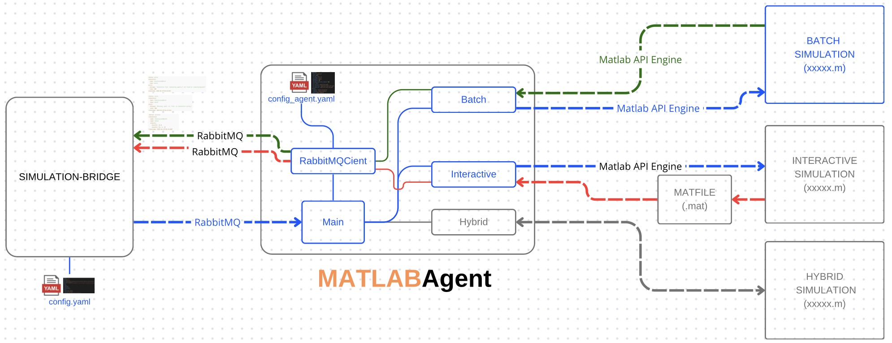

# <span style="color:orange">MATLAB</span> Agent

## Documentation

**MATLAB Agent** is a Python-based connector designed to interface with MATLAB simulations using the MATLAB Engine API. It enables control, interaction, input/output exchange, and monitoring of three types of simulations:

- Batch Simulation – send inputs and retrieve results.
- Interactive Simulation (Agent Based) – interact and visualize data in real time.
- Hybrid Simulation – mix of interactive control and output processing.

Communication with the Simulation Bridge, as well as other potential external systems, is handled by default through RabbitMQ. Configuration is driven by a **config_agent.yaml** file which sets up the message queues and RabbitMQ connectivity.

<!-- <div align="center">
  
</div> -->

# Architecture Overview

<div align="center">
  
</div>

## Simulation Types and Flow

### General Flow

1. The **Simulation Bridge** sends input as a YAML string via **RabbitMQ** (see [Message Format](#message-format)).

2. `RabbitMQClient` receives the message and subscribes to the appropriate queues based on the parameters defined in `config_agent.yaml` (see [Configuration](#configuration)).

3. `Main` routes the message to the appropriate simulation handler. Depending on the specified simulation type, control is passed to:
   - `Batch`
   - `Interactive`
   - `Hybrid`

---

### 1. Batch Simulation

- Executes a MATLAB `.m` script (Simulation) using the **MATLAB API Engine for Python**.
- Simulation results are returned as structured Python objects.
- Results are encoded as YAML strings and published back to the Simulation Bridge via RabbitMQ.

> 📁 Example output messages can be found in the `/images/output-batch-*` folder.

<div align="center">
  
  
  
</div>

---

### 2. Interactive Simulation

- The MATLAB simulation must save runtime data to a `.mat` file named `agent_data.mat`
- The `Interactive` module reads variables in real time from the `.mat` file.
- Data is streamed continuously to the Simulation Bridge via RabbitMQ.

---

### 3. Hybrid Simulation

> 🚧 **Work in Progress**

- Aims to support both:
  - Real-time interaction with the simulation.
  - Batch-style output processing.
- Designed to enable dynamic scenario adjustment during execution.

---

## Communication with Matlab

All modules use the MATLAB Engine API for Python to control MATLAB sessions.

---

## Configuration

### `config_agent.yaml`

This file configures:

- RabbitMQ connection (host, port, credentials)
- Queue names for subscription and publishing

#### Example:

```yaml
rabbitmq:
  host: "localhost"
  port: 5672
  virtual_host: "/"
  username: "guest"
  password: "guest"
  heartbeat: 60
  blocked_connection_timeout: 300
  ssl: false
  ssl_cafile: "/path/to/ca.pem"
  ssl_certfile: "/path/to/client_cert.pem"
  ssl_keyfile: "/path/to/client_key.pem"
queues:
  request: "queue_simulation"
  response: "queue_response"
  data: "agent_updates"
```

---

## Message Format

**Simulation Bridge → MATLAB Agent**

```python
message = yaml.dump({'simulation': simulation_data['simulation']})
```

The agent expects an input message formatted as valid YAML containing the simulation parameters.

---

## Dependencies

- Python **3.8+**
- **MATLAB** with the **MATLAB Engine API for Python** installed
- **RabbitMQ** server (local or remote)

### MATLAB Engine API Installation

Ensure that the **MATLAB Engine API for Python** is properly installed by following the official instructions provided by MathWorks:

🔗 [MATLAB Engine API for Python - Installation Guide](https://www.mathworks.com/help/matlab/matlab-engine-for-python.html)

#### Example (macOS)

If you're using macOS (e.g., with MATLAB R2024b), you can install the engine using the following steps:

```bash
poetry shell
cd /Applications/MATLAB_R2024b.app/extern/engines/python
python -m pip install .
```

> 💡 Replace the MATLAB version path (`MATLAB_R2024b.app`) with the one corresponding to your installed version if different.

---

## Usage

### 1. Configure the Agent

Edit the `config_agent.yaml` file with the correct RabbitMQ credentials and simulation settings.

### 2. Run the Agent

```bash
python main.py
```

The agent will start listening on the configured RabbitMQ queues and route simulation requests based on the selected simulation mode (batch, interactive, or hybrid).

## Author

<div align="left" style="display: flex; align-items: center; gap: 15px;">
  
  <div>
    <h3 style="margin: 0;">Marco Melloni</h3>
    <div style="margin-top: 5px;">
      <a href="https://www.linkedin.com/in/marco-melloni/">
        
      </a>
      <a href="https://github.com/marcomelloni" style="margin-left: 8px;">
        
      </a>
    </div>
  </div>
</div>
