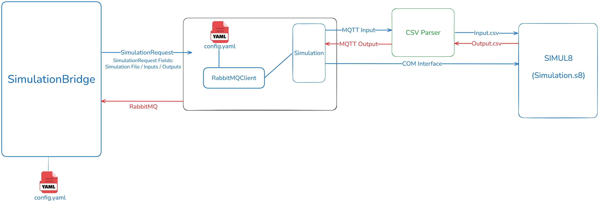
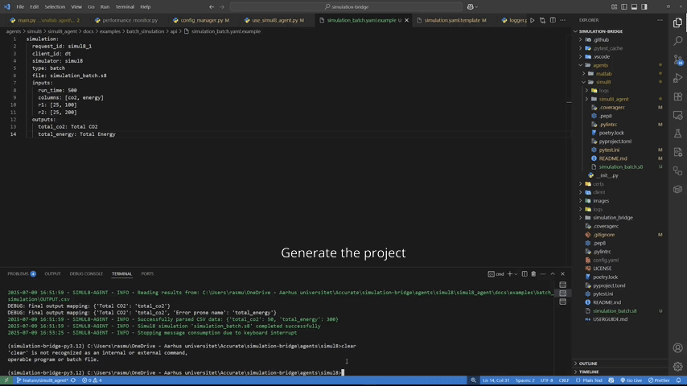

# Simul8 Agent

The Simul8 Agent is a Python-based connector designed to interface with Simul8 simulations through a singular method.

- **Batch Simulation**: Executes predefined Simul8 Simulation with specified input parameters, collecting the final results upon completion.

The Simul8Agent 
The Simul8 Agent is primarily built to integrate with the Simulation Bridge but can also be utilized by external systems via RabbitMQ exchange methods. Communication parameters and other settings must be defined in the YAML-based configuration file.

<div align="center">
  
</div>

## Table of Contents

- [Simul8 agent](#simul8-agent)
  - [Table of Contents](#table-of-contents)
  - [Demo Video](#demo-video)
  - [Requirements](#requirements)
    - [Installation](#installation)
      - [1. Clone the Repository and Navigate to the Working Directory](#1-clone-the-repository-and-navigate-to-the-working-directory)
      - [2. Install Poetry and Create Virtual Environment](#2-install-poetry-and-create-virtual-environment)
      - [3. Install Project Dependencies](#3-install-project-dependencies)
    - [Configuration](#configuration)
  - [Usage](#usage)
    - [Getting Started](#getting-started)
    - [Running the Agent](#running-the-agent)
  - [Distributing the Package as a PIP Package with Poetry](#distributing-the-package-as-a-pip-package-with-poetry)
    - [Verifying the Package (Optional but Recommended)](#verifying-the-package-optional-but-recommended)
    - [Releasing a New Version](#releasing-a-new-version)
  - [Demonstration](#demonstration)
  - [Quick Start: Interacting with the Simul8 Agent](#quick-start-interacting-with-the-simul8-agent)
  - [Workflow](#workflow)
  - [Package Development](#package-development)
  - [Author](#author)

## Demo Video

For a comprehensive demonstration of the Simul8 Agent in action, you can:

- [Watch the full video (MP4 format)](simul8_agent/images/demo-simul8-edited.mp4) 

Or view a quick preview below:

<p align="center">
  
</p>

<p align="center"><i>A video demonstration of the Simul8 Agent in action</i></p>

## Requirements

### Installation

#### 1. Clone the Repository and Navigate to the Working Directory

```bash
git clone https://github.com/INTO-CPS-Association/simulation-bridge.git
cd simulation-bridge
```

#### 2. Install Poetry and Create Virtual Environment

Ensure that Poetry is installed on your system. If it is not already installed, execute the following commands:

```bash
python3 -m pip install --user pipx
python3 -m pipx ensurepath
pipx install poetry
```

Verify the installation by checking the Poetry version:

```bash
poetry --version
```

Activate the virtual environment:

```bash
poetry env activate
```

> **Important:**  
> The command `poetry env activate` does not automatically activate the virtual environment; instead, it prints the command you need to run to activate it.  
> You must copy and paste the displayed command, for example:

```bash
source /path/to/virtualenv/bin/activate
```

Verify that the environment is active by checking the Python path:

```bash
which python
```

#### 3. Install Project Dependencies

Run the following command to install all dependencies defined in `pyproject.toml`:

```bash
poetry install
```

### Configuration

The configuration is specified in yaml format. A template file (`simul8_agent/config/config.yaml.template`) has been provided. It can be customized further.

Explanation on different fields of the yaml template is given below.

```yaml
agent:
  agent_id: simul8 # Specifies the unique identifier for the agent. This ID is used to distinguish the agent in the system.
  simulator: simul8 # Specifies the name of the simulator

rabbitmq:
  host: localhost # The hostname or IP address of the RabbitMQ server.
  port: 5672 # The port number for RabbitMQ communication (default is 5672).
  username: guest # The username for authenticating with RabbitMQ.
  password: guest # The password for authenticating with RabbitMQ.
  heartbeat: 600 # The heartbeat interval (in seconds) to keep the connection alive.
  vhost: / # The virtual host to use for RabbitMQ connections.

simulation:
  path: /Users/foo/simulation-bridge/agents/simul8/simul8_agent/docs/examples # The file path to the folder containing simul8 simulation files.

exchanges:
  input: ex.bridge.output # The RabbitMQ exchange from which the agent receives commands.
  output: ex.sim.result # The RabbitMQ exchange to which the agent sends simulation results.

queue:
  durable: true # Ensures that the queue persists across RabbitMQ broker restarts.
  prefetch_count: 1 # Limits the number of unacknowledged messages the agent can receive at a time.

logging:
  level: INFO # Specifies the logging level. Options include DEBUG, INFO, and ERROR.
  file: logs/simul8_agent.log # The file path where logs will be stored.

tcp:
  host: localhost # The hostname or IP address for TCP communication.
  port: 5678 # The port number for TCP communication.

response_templates:
  success:
    status: success # Indicates a successful simulation response.
    simulation:
      type: batch # Specifies the type of simulation (e.g., batch or streaming).
    timestamp_format: "%Y-%m-%dT%H:%M:%SZ" # The timestamp format in ISO 8601 with a Z suffix for UTC.
    include_metadata: true # Determines whether metadata is included in the response.
    metadata_fields: # Specifies the metadata fields to include in the response.
      - execution_time
      - memory_usage
      - simul8_version

  error:
    status: error # Indicates an error response.
    include_stacktrace: false # For security, stack traces are excluded in production environments.
    error_codes: # Maps specific error scenarios to HTTP-like status codes.
      invalid_config: 400 # Error code for invalid configuration.
      simul8_start_failure: 500 # Error code for simul8 startup failure.
      execution_error: 500 # Error code for simulation execution errors.
      timeout: 504 # Error code for simulation timeout.
      missing_file: 404 # Error code for missing files.

    timestamp_format: "%Y-%m-%dT%H:%M:%SZ" # The timestamp format in ISO 8601 with a Z suffix for UTC.

  progress:
    status: in_progress # Indicates that the simulation is currently in progress.
    include_percentage: true # Includes the percentage of completion in progress updates.
    update_interval: 5 # Specifies the interval (in seconds) for sending progress updates.
    timestamp_format: "%Y-%m-%dT%H:%M:%SZ" # The timestamp format in ISO 8601 with a Z suffix for UTC.
```

## Usage

The agent requires a configuration file to run. You can start by copying the provided template and customizing it as needed.

### Getting Started

**Generate a configuration file template:**

```bash
poetry run simul8-agent --generate-config
```

This command creates a `config.yaml` file in your current directory. If the file already exists, it will not be overwritten.

**Generate Project Files:**

To create a complete set of template files for your Simul8 agent project:

```bash
poetry run simul8-agent --generate-project
```

This command creates the following structure in your current directory (existing files won't be overwritten):

```
.
├── config.yaml                 # Agent configuration settings
├── SimulationBatch.ms8          # Template for batch simulations
```

Each template file contains documentation and can be customized for your specific simulation requirements.

### Running the Agent

To start the Simul8 Agent with the default configuration:

```bash
poetry run simul8-agent
```

To use a custom configuration file:

```bash
poetry run simul8-agent --config-file <path_to_config.yaml>
```

Or use the shorthand:

```bash
poetry run simul8-agent -c <path_to_config.yaml>
```

## Distributing the Package as a PIP Package with Poetry

To create the package, run the following command in the project's root directory (where `pyproject.toml` is located):

```bash
poetry build
```

This will generate two files in the `dist/` folder:

- A `.whl` file → (Wheel Package).
- A `.tar.gz` file → (Source Archive).

Example output:

```bash
dist/
├── simul8_agent-0.2.0-py3-none-any.whl
└── simul8_agent-0.2.0.tar.gz
```

### Verifying the Package (Optional but Recommended)

You can verify that the package works by installing it locally:

```bash
pip install dist/simul8_agent-0.2.0-py3-none-any.whl
```

Then, run the command defined in the script:

```bash
simul8-agent
```

### Releasing a New Version

When you modify the code and want to release a new version, increment the version number in `pyproject.toml`:

```toml
version = "0.3.0"
```

Then rebuild the package:

```bash
poetry build
```

## Demonstration

For instructions on running tests created with `pytest` and `unittest.mock`, please refer to the [Tests Documentation](simul8_agent/tests/README.md).

## Quick Start: Interacting with the Simul8 Agent

To quickly get started, generate the default project structure by running:

```bash
poetry run simul8-agent --generate-project
```

This will create a `client/` directory in the root of your project containing all necessary files for interaction.

Next, move into the client directory:

```bash
cd client
```

Inside this folder, you'll find:

- `use.yaml` — Configuration file for the communication protocol (e.g., RabbitMQ settings)
- `simulation.yaml` — The simulation request payload that will be sent to the Simul8 Agent
- `use_simul8_agent.py` — Python script to send the request and receive the results

For detailed instructions on how to configure and use the client, refer to the [Use Simul8 Agent](./simul8_agent/resources/README.md) in the `agents/simul8/simul8_agent/resources/` folder.

## Workflow

1. The agent connects to RabbitMQ and sets up the required queues and exchanges.
2. It listens for incoming messages on its dedicated queue.
3. Upon receiving a message:

- It analyzes and processes the simulation request.
- Executes the simulation.
- Sends the results to the output exchange.

For detailed information regarding simulations and constraints, please refer to the [Simulations and Constraints Documentation](simul8_agent/docs/README.md).

## Package Development

The developer-specific commands are

```bash
pytest
pylint simul8_agent
autopep8 --in-place --aggressive --recursive 'simul8_agent'
```

## Author

<div style="display: flex; flex-direction: column; gap: 25px;"> <!-- Marco Melloni --> <div style="display: flex; align-items: center; gap: 15px;">  <div> <h3 style="margin: 0;">Marco Melloni</h3> <p style="margin: 4px 0;">Digital Automation Engineering Student<br> University of Modena and Reggio Emilia, Department of Sciences and Methods for Engineering (DISMI)</p> <div> <a href="https://www.linkedin.com/in/marco-melloni/">  </a> <a href="https://github.com/marcomelloni" style="margin-left: 8px;">  </a> </div> </div> </div> <!-- Marco Picone --> <div style="display: flex; align-items: center; gap: 15px;">  <div> <h3 style="margin: 0;">Prof. Marco Picone</h3> <p style="margin: 4px 0;">Associate Professor<br> University of Modena and Reggio Emilia, Department of Sciences and Methods for Engineering (DISMI)</p> <div> <a href="https://www.linkedin.com/in/marco-picone-8a6a4612/">  </a> <a href="https://github.com/piconem" style="margin-left: 8px;">  </a> </div> </div> </div> <!-- Prasad Talasila --> <div style="display: flex; align-items: center; gap: 15px;"> <!-- Placeholder image -->  <div> <h3 style="margin: 0;">Dr. Prasad Talasila</h3> <p style="margin: 4px 0;">Postdoctoral Researcher<br> Aarhus University</p> <div> <a href="https://www.linkedin.com/in/prasad-talasila/">  </a> <a href="https://github.com/prasadtalasila" style="margin-left: 8px;">  </a> </div> </div> </div> </div>
<!-- Rasmus Carlsen --> <div style="display: flex; align-items: center; gap: 15px;"> <!-- Placeholder image -->  <div> <h3 style="margin: 0;">Rasmus Carlsen</h3> <p style="margin: 4px 0;">Computer Engineering Student<br> Aarhus University</p> <div> <a href="https://www.linkedin.com/in/rasmuscarlsen/">  </a> <a href="https://github.com/Rasmus-M-C" style="margin-left: 8px;">  </a> </div> </div> </div> </div>
