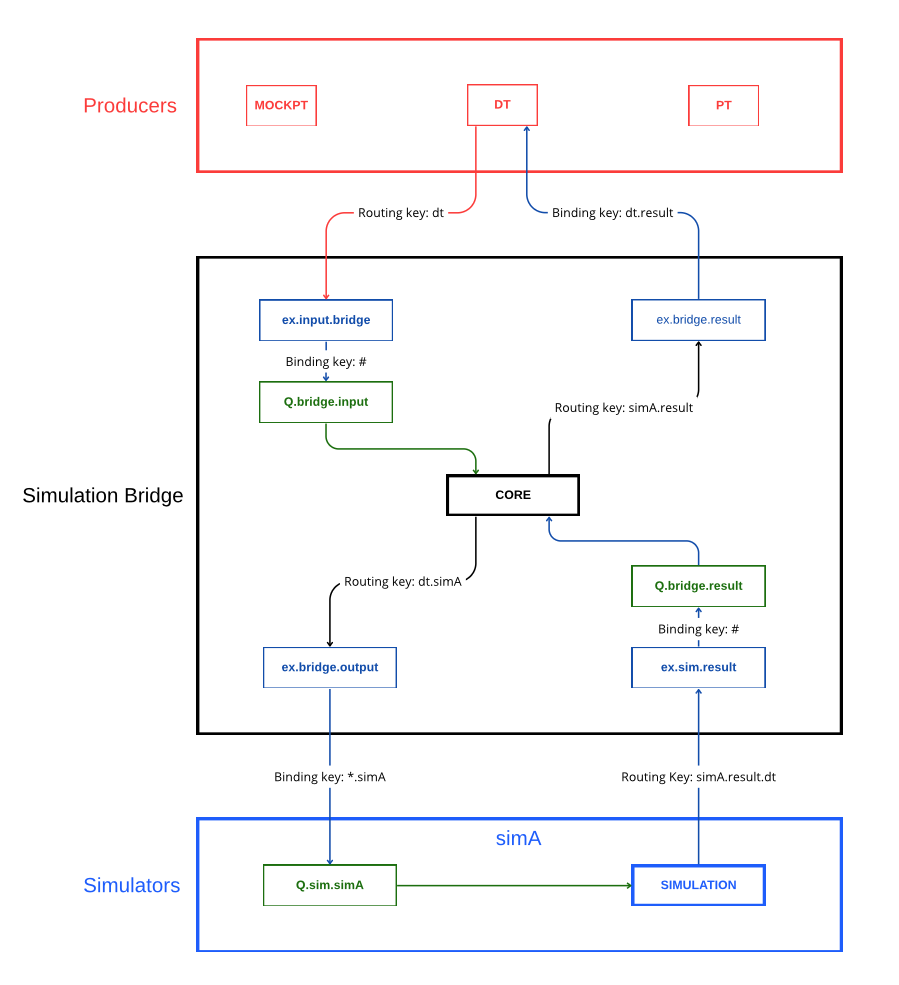

# Architecture

The system facilitates seamless bidirectional communication between Digital Twin (DT), Mock Physical Twin (MockPT), Physical Twin (PT), and simulators using a RabbitMQ-based messaging bridge.

  

### Key Components

1. **Data Sources (DT, PT, MockPT)**

- **Sending**: Generate data and publish it to the `ex.input.bridge` exchange with routing keys in the format `<source>` (e.g., `dt`, `pt`).
- **Receiving**: Receive simulation results via the `ex.bridge.result` exchange on dedicated queues (e.g., `Q.dt.result`).

2. **Simulation Bridge**

- **Input**: Receives messages from the `Q.bridge.input` queue and forwards them to simulators via the `ex.bridge.output` exchange.
- **Output**: Receives simulation results from the `Q.bridge.result` queue and forwards them to data sources via the `ex.bridge.result` exchange.

3. **Simulators**

- **Input**: Listen on specific queues to receive simulation requests.
- **Output**: Publish results to the `ex.sim.result` exchange with routing keys in the format `<sim_id>.result.<destination>`.

### RabbitMQ Topology

#### Exchanges

| Exchange Name      | Type  | Description                                     |
| ------------------ | ----- | ----------------------------------------------- |
| `ex.input.bridge`  | Topic | Entry point for all incoming data.              |
| `ex.bridge.output` | Topic | Exit point for routing messages to simulators.  |
| `ex.sim.result`    | Topic | Entry point for simulation results.             |
| `ex.bridge.result` | Topic | Exit point for routing results to data sources. |

#### Queues

| Queue Name          | Binding Key | Description                                                   |
| ------------------- | ----------- | ------------------------------------------------------------- |
| `Q.bridge.input`    | `#`         | Receives all incoming messages.                               |
| `Q.bridge.result`   | `#`         | Receives all simulation results.                              |
| `Q.sim.<ID>`        | `*.<ID>`    | Dedicated queues for each simulation.                         |
| `Q.<source>.result` | `*.result`  | Dedicated queues for receiving results (e.g., `Q.dt.result`). |

### Data Flow

#### Request Flow (DT → Simulator)

1. DT publishes to `ex.input.bridge` with routing key `dt`.
2. The bridge receives the message from the `Q.bridge.input` queue.
3. The bridge forwards the message to `ex.bridge.output` with routing key `dt.simX`.
4. The simulator receives the message from its queue `Q.sim.X`.

#### Response Flow (Simulator → DT)

1. The simulator publishes to `ex.sim.result` with routing key `simX.result.dt`.
2. The bridge receives the message from the `Q.bridge.result` queue.
3. The bridge forwards the message to `ex.bridge.result` with routing key `simX.result`.
4. DT receives the message from its queue `Q.dt.result`.
5.

## Author

  
  

    <h3 style="margin: 0;">Marco Melloni</h3>
    

      
      
    

  

