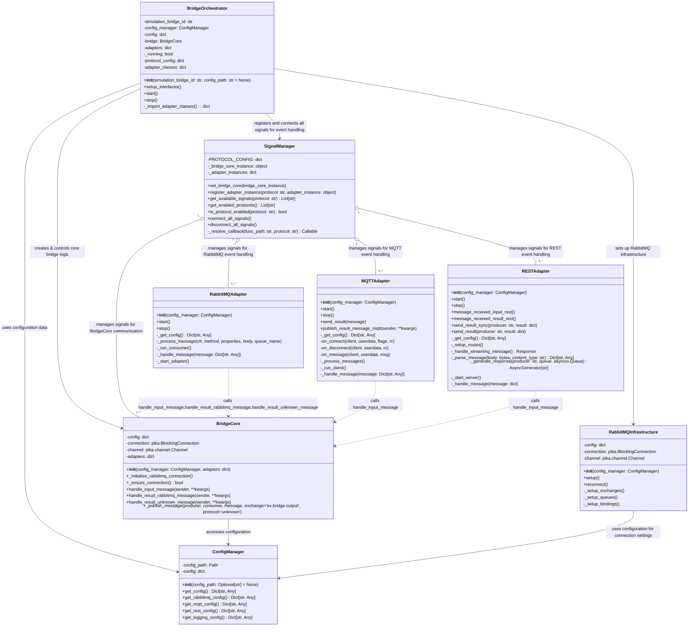

```mermaid
classDiagram
    class BridgeOrchestrator {
        -simulation_bridge_id: str
        -config_manager: ConfigManager
        -config: dict
        -bridge: BridgeCore
        -adapters: dict
        -_running: bool
        -protocol_config: dict
        -adapter_classes: dict
        +__init__(simulation_bridge_id: str, config_path: str = None)
        +setup_interfaces()
        +start()
        +stop()
        -_import_adapter_classes(): dict
    }

    class BridgeCore {
        -config: dict
        -connection: pika.BlockingConnection
        -channel: pika.channel.Channel
        -adapters: dict
        +__init__(config_manager: ConfigManager, adapters: dict)
        +_initialize_rabbitmq_connection()
        +_ensure_connection() bool
        +handle_input_message(sender, **kwargs)
        +handle_result_rabbitmq_message(sender, **kwargs)
        +handle_result_unknown_message(sender, **kwargs)
        +_publish_message(producer, consumer, message, exchange='ex.bridge.output', protocol='unknown')
    }

    class RabbitMQInfrastructure {
        -config: dict
        -connection: pika.BlockingConnection
        -channel: pika.channel.Channel
        +__init__(config_manager: ConfigManager)
        +setup()
        +reconnect()
        -_setup_exchanges()
        -_setup_queues()
        -_setup_bindings()
    }

    class ConfigManager {
        -config_path: Path
        -config: dict
        +__init__(config_path: Optional[str] = None)
        +get_config() Dict[str, Any]
        +get_rabbitmq_config() Dict[str, Any]
        +get_mqtt_config() Dict[str, Any]
        +get_rest_config() Dict[str, Any]
        +get_logging_config() Dict[str, Any]
    }

    class SignalManager {
        -PROTOCOL_CONFIG: dict
        -_bridge_core_instance: object
        -_adapter_instances: dict
        +set_bridge_core(bridge_core_instance)
        +register_adapter_instance(protocol: str, adapter_instance: object)
        +get_available_signals(protocol: str) List[str]
        +get_enabled_protocols() List[str]
        +is_protocol_enabled(protocol: str) bool
        +connect_all_signals()
        +disconnect_all_signals()
        -_resolve_callback(func_path: str, protocol: str) Callable
    }

    class RabbitMQAdapter {
        +__init__(config_manager: ConfigManager)
        +start()
        +stop()
        -_get_config() Dict[str, Any]
        -_process_message(ch, method, properties, body, queue_name)
        -_run_consumer()
        -_handle_message(message: Dict[str, Any])
        -_start_adapter()
    }


    class MQTTAdapter {
        +__init__(config_manager: ConfigManager)
        +start()
        +stop()
        +send_result(message)
        +publish_result_message_mqtt(sender, **kwargs)
        -_get_config() Dict[str, Any]
        -on_connect(client, userdata, flags, rc)
        -on_disconnect(client, userdata, rc)
        -on_message(client, userdata, msg)
        -_process_messages()
        -_run_client()
        -_handle_message(message: Dict[str, Any])
    }

    class RESTAdapter {
        +__init__(config_manager: ConfigManager)
        +start()
        +stop()
        +message_received_input_rest()
        +message_received_result_rest()
        +send_result_sync(producer: str, result: dict)
        +send_result(producer: str, result: dict)
        -_get_config() Dict[str, Any]
        -_setup_routes()
        -_handle_streaming_message() Response
        -_parse_message(body: bytes, content_type: str) Dict[str, Any]
        -_generate_response(producer: str, queue: asyncio.Queue) AsyncGenerator[str]
        -_start_server()
        -_handle_message(message: dict)
    }


    BridgeOrchestrator --> ConfigManager : uses configuration data
    BridgeOrchestrator --> SignalManager : registers and connects all signals for event handling
    BridgeOrchestrator --> BridgeCore : creates & controls core bridge logic
    BridgeOrchestrator --> RabbitMQInfrastructure : sets up RabbitMQ infrastructure
    BridgeCore --> ConfigManager : accesses configuration
    RabbitMQInfrastructure --> ConfigManager : uses configuration for connection settings
    SignalManager "1" o-- "1..*" BridgeCore : manages signals for BridgeCore communication
    SignalManager "1" o-- "1..*" RabbitMQAdapter : manages signals for RabbitMQ event handling
    SignalManager "1" o-- "1..*" MQTTAdapter : manages signals for MQTT event handling
    SignalManager "1" o-- "1..*" RESTAdapter : manages signals for REST event handling

    RabbitMQAdapter ..> BridgeCore : calls handle_input_message,handle_result_rabbitmq_message,handle_result_unknown_message
    MQTTAdapter ..> BridgeCore : calls handle_input_message
    RESTAdapter ..> BridgeCore : calls handle_input_message
```
