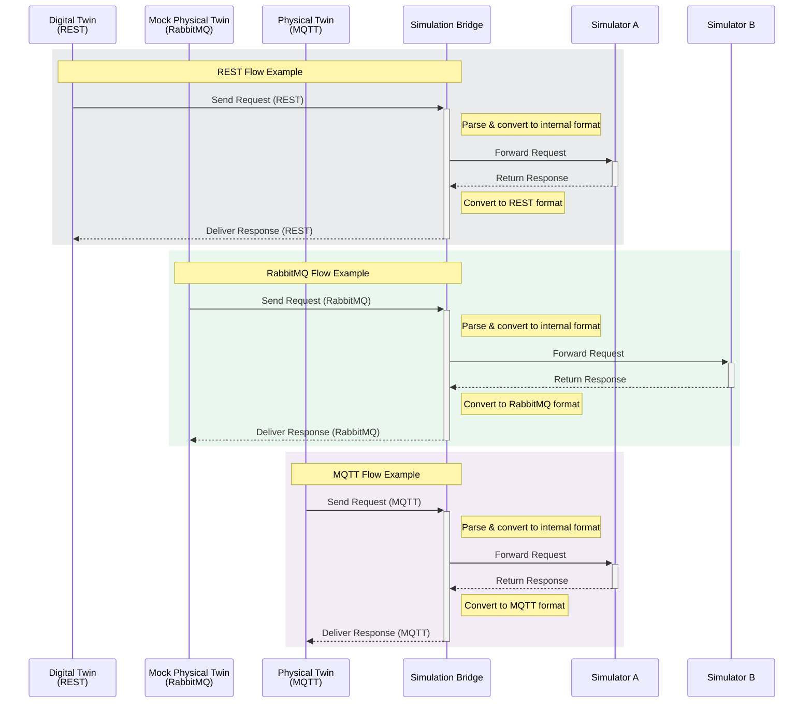

# Simulation Bridge Internal Architecture

This document provides a detailed explanation of the Simulation Bridge's internal architecture, components, and their interactions.

## Overview

The Simulation Bridge is designed as a modular system that enables communication between different protocols (RabbitMQ, MQTT, REST) while maintaining a consistent message format and routing logic. The system is built with extensibility and maintainability in mind.

## Core Components

### 1. BridgeOrchestrator

The `BridgeOrchestrator` is the main coordinator of the system. It's responsible for:

- Initializing and managing all protocol adapters
- Setting up the infrastructure
- Managing the lifecycle of all components
- Monitoring the health of adapters

```python
class BridgeOrchestrator:
    def __init__(self, simulation_bridge_id: str, config_path: str = None):
        # Initialize configuration and component registry
        self.adapter_classes = {
            'rabbitmq': RabbitMQAdapter,
            'mqtt': MQTTAdapter,
            'rest': RESTAdapter,
        }
```

### 2. BridgeCore

The `BridgeCore` is the central message router and processor. It:

- Maintains connections to all protocols
- Routes messages between different protocols
- Handles message transformation
- Manages message metadata

```python
class BridgeCore:
    def __init__(self, config_manager: ConfigManager):
        # Initialize connections and signal handlers
signal('message_received_input_rabbitmq').connect(self.handle_input_rabbitmq_message)
        signal('message_received_input_mqtt').connect(self.handle_input_mqtt_message)
        signal('message_received_input_rest').connect(self.handle_input_rest_message)
```

### 3. Infrastructure

The `RabbitMQInfrastructure` class manages the RabbitMQ infrastructure setup:

- Exchange declarations
- Queue declarations
- Binding configurations

```python
class RabbitMQInfrastructure:
        def setup(self):
                self._setup_exchanges()
                self._setup_queues()
                self._setup_bindings()
```

## Message Flow



## Signal System

The bridge uses the Blinker signal system for internal communication:

- `message_received_input_*`: Signals for incoming messages
- `message_received_result_*`: Signals for result messages
- `message_received_other_*`: Signals for other message types

## Configuration Management

The system uses centralized YAML-based configuration, with dedicated sections for each protocol, infrastructure settings, and logging

## Threading Model

The system uses a multi-threaded architecture:

- Each adapter runs in its own thread
- Main thread monitors adapter health
- Clean shutdown mechanism
