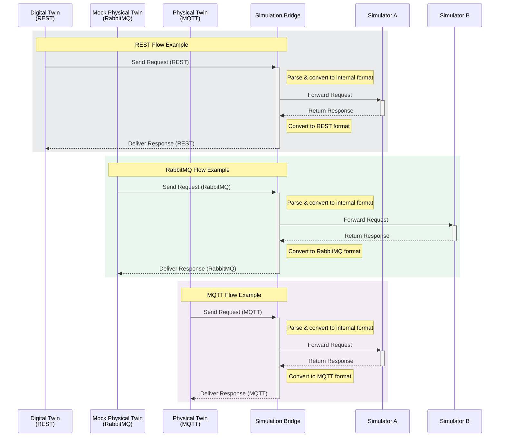

# Simulation Bridge Internal Architecture

This document provides a detailed explanation of the Simulation Bridge's internal architecture, components, and their interactions.

## Overview

The Simulation Bridge is designed as a modular system that enables communication between different protocols (RabbitMQ, MQTT, REST) while maintaining a consistent message format and routing logic. The system is built with extensibility and maintainability in mind.

## Core Components

### 1. BridgeOrchestrator

The `BridgeOrchestrator` is the main coordinator of the system. It's responsible for:

- Initializing and managing all protocol adapters
- Setting up the infrastructure
- Managing the lifecycle of all components
- Monitoring the health of adapters

```python
class BridgeOrchestrator:
    def __init__(self, simulation_bridge_id: str, config_path: str = None):
        # Initialize configuration and component registry
        self.adapter_classes = {
            'rabbitmq': RabbitMQAdapter,
            'mqtt': MQTTAdapter,
            'rest': RESTAdapter,
        }
```

### 2. BridgeCore

The `BridgeCore` is the central routing and processing hub that:

- Facilitates cross-protocol communication (RabbitMQ, MQTT, REST)
- Manages message routing between Digital Twins, MockPTs, and Simulators
- Handles signal processing from all protocol adapters
- Transforms messages between protocol formats
- Adds `bridge_meta` tracking information to all messages
- Implements automatic reconnection and error recovery
- Supports input, result, and generic message types

#### Message Metadata Management

The `BridgeCore` enriches each message with metadata to facilitate routing and tracking:

- Each message contains a `bridge_meta` section that enables return routing
- Protocol information is preserved to ensure proper message format conversion
- Unique request IDs allow for request-response correlation

Example of message metadata:

```json
{
  "simulation": {
    "request_id": "abc123",
    "bridge_meta": {
      "protocol": "rabbitmq"
    }
  }
}
```

This metadata tracking system enables the Bridge to route responses back through the correct protocol adapter

### 3. Infrastructure

The `RabbitMQInfrastructure` class manages the RabbitMQ infrastructure setup:

- Exchange declarations
- Queue declarations
- Binding configurations

```python
class RabbitMQInfrastructure:
        def setup(self):
                self._setup_exchanges()
                self._setup_queues()
                self._setup_bindings()
```

## Message Flow



### Signal System

The bridge uses [Blinker](https://pythonhosted.org/blinker/) for internal message dispatching across protocols.  
Signal routing is handled via the `SignalManager` class located in `utils/signal_manager.py`.

#### Available Signals by Protocol

| Protocol | Signals                                                                                                      |
| -------- | ------------------------------------------------------------------------------------------------------------ |
| RabbitMQ | `message_received_input_rabbitmq`<br>`message_received_result_rabbitmq`<br>`message_received_other_rabbitmq` |
| MQTT     | `message_received_input_mqtt`                                                                                |
| REST     | `message_received_input_rest`                                                                                |

#### SignalManager Responsibilities

- Centralizes signal definition and access control
- Ensures only valid signals are connected or disconnected
- Wraps Blinker’s native `signal().connect()` and `signal().disconnect()` methods
- Provides logging for all operations

#### Example: Connecting a Signal

```python
from utils.signal_manager import SignalManager

SignalManager.connect_signal(
    protocol='rabbitmq',
    signal_name='message_received_input_rabbitmq',
    callback=my_callback_function
)
```

## Configuration Management

The system uses centralized YAML-based configuration, with dedicated sections for each protocol, infrastructure settings, and logging

## Threading Model

The system uses a multi-threaded architecture:

- Each adapter runs in its own thread
- Main thread monitors adapter health
- Clean shutdown mechanism
