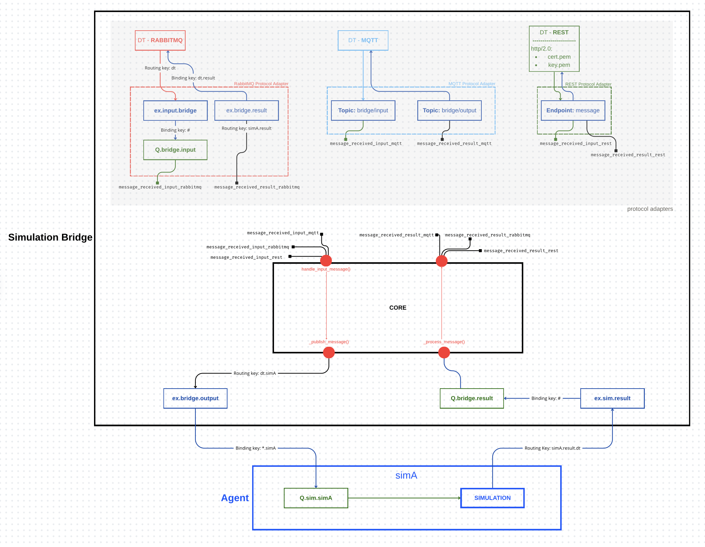
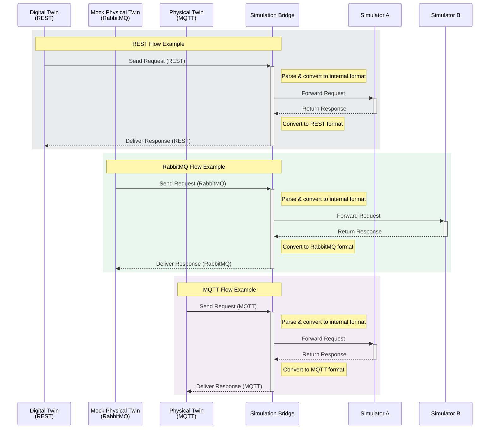

# Simulation Bridge Internal Architecture

The Simulation Bridge is designed according to an event-driven architecture. Each simulation request is transformed into an independent event, enabling asynchronous and non-blocking process management. Converting requests into events allows decoupling the communication flow between clients and simulators.

## Message Flow

## Signal System

The Simulation Bridge implements an event-driven message dispatching system using Blinker for internal signal routing across protocols.

The `SignalManager` class (located in `utils/signal_manager.py`) serves as the central component for managing signal flow:

- Automatically loads signal definitions from protocol configuration files (e.g., `adapters_signal.json`)
- Registers all protocol adapters and the `BridgeCore` instance
- Maps signal names (e.g., `message_received_input_mqtt`) to their corresponding handler methods (e.g., `BridgeCore.handle_input_message`)
- Facilitates clean disconnection of all signals during shutdown
- Provides comprehensive logging for debugging and traceability

This approach effectively decouples protocol-specific logic from the core business logic, enabling flexible signal routing based on the configured architecture.

### Protocol Signal Reference

| Protocol | Available Signals                                                       |
| -------- | ----------------------------------------------------------------------- |
| RabbitMQ | `message_received_input_rabbitmq` `message_received_result_rabbitmq` |
| MQTT     | `message_received_input_mqtt` `message_received_result_mqtt`         |
| REST     | `message_received_input_rest` `message_received_result_rest`         |

## Threading Model

The system uses a multi-threaded architecture:

- Each adapter runs in its own thread
- Main thread monitors adapter health
- Clean shutdown mechanism
