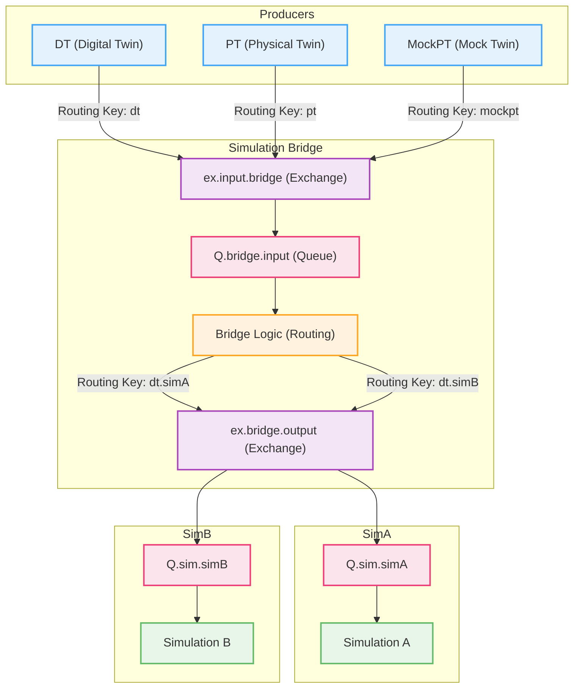

# RabbitMQ Messaging System

## System Architecture

### Main Components

- **Data Sources (DT, PT, MockPT)**  
   These components generate data and publish it to the `ex.input.bridge` exchange.  
   Routing key format: `<source>` (e.g., `dt`, `pt`).

- **Simulation Bridge**  
   Acts as an intermediary, receiving messages from the `Q.bridge.input` queue.  
   Processes and routes messages to the `ex.bridge.output` exchange.  
   Routing key format: `<source>.<destination>`.

- **Simulations**  
   Specialized consumers that listen to specific queues.  
   Binding pattern: `*.simX` to capture messages intended for `simX`.

## RabbitMQ Topology

| **Exchange**       | **Type** | **Description**                    |
| ------------------ | -------- | ---------------------------------- |
| `ex.input.bridge`  | `topic`  | Entry point for all incoming data. |
| `ex.bridge.output` | `topic`  | Exit point for advanced routing.   |

| **Queue**        | **Binding Key** | **Description**                   |
| ---------------- | --------------- | --------------------------------- |
| `Q.bridge.input` | `#`             | Receives all input messages.      |
| `Q.sim.<ID>`     | `*.<ID>`        | Dedicated queues for simulations. |

## Routing Key Specification

### Format

`<source>.<destination>`

- **Source**: Unique identifier of the producer.  
   Examples: `dt`, `pt`, `mockpt`.

- **Destination**: Identifier of the recipient.
  - Format: `sim<ID>` for specific simulations.
  - Use `broadcast` for general messages.

### Examples

| **Scenario**          | **Routing Key** | **Description**           |
| --------------------- | --------------- | ------------------------- |
| DT → Simulation A     | `dt.simA`       | Direct message.           |
| PT → Broadcast        | `pt.broadcast`  | Message to all consumers. |
| MockPT → Simulation B | `mockpt.simB`   | Message from mock source. |

## Data Flow

### Message Publishing

Producers publish to `ex.input.bridge` with:

- A base routing key (`source`).
- A payload containing a `destinations` field.

### Bridge Processing

- Messages are received from `Q.bridge.input`.
- For each destination in the payload:
  - The full routing key is constructed.
  - The message is re-published to `ex.bridge.output`.

### Message Consumption

Simulations consume messages:

- With routing keys ending in their ID.
- From any authorized source.

## Flow Diagram



### Instructions for Use

1. Start RabbitMQ.
2. Launch the bridge: `python bridge.py`.
3. Start the simulations:
   ```bash
   python simulation.py simA
   python simulation.py simB
   ```
4. Send messages:
   ```bash
   python dt.py
   ```

## Author

<div align="left" style="display: flex; align-items: center; gap: 15px;">
  
  <div>
    <h3 style="margin: 0;">Marco Melloni</h3>
    <div style="margin-top: 5px;">
      <a href="https://www.linkedin.com/in/marco-melloni/">
        
      </a>
      <a href="https://github.com/marcomelloni" style="margin-left: 8px;">
        
      </a>
    </div>
  </div>
</div>
